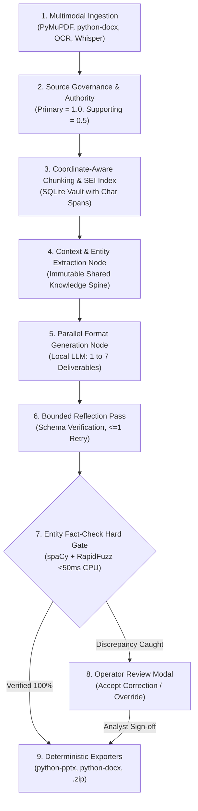

# Sentinel-Transform: Sovereign Multi-Format Intelligence Transformation Platform
### Smart India Hackathon (SIH 2026) | Problem Statement ID: 26154
**Ministry / Organisation**: National Technical Research Organisation (NTRO)  
**Theme**: Blockchain & Cybersecurity / AI & Machine Learning | **Category**: Software  

[](README.md)
[-success.svg)](README.md)
[](README.md)
[](README.md)
[](README.md)
[-brightgreen.svg)](README.md)

---

## 📑 Detailed Table of Contents & Navigation Index

- [1. Executive Summary & Problem Statement](#1-executive-summary--problem-statement)
- [2. SIH Expected Solution & Deliverables for Evaluation](#2-sih-expected-solution--deliverables-for-evaluation)
- [3. Transformation Formats Generated (Full 7-Format Matrix)](#3-transformation-formats-generated-full-7-format-matrix)
  - [3.1 Video Production Package (`video`)](#1-video-production-package-video)
  - [3.2 LinkedIn Post (`linkedin`)](#2-linkedin-post-linkedin)
  - [3.3 Twitter / X Thread (`twitter`)](#3-twitter--x-thread-twitter)
  - [3.4 Intelligence Advisory (`advisory`)](#4-intelligence-advisory-advisory)
  - [3.5 Infographic Content Specification (`infographic`)](#5-infographic-content-specification-infographic)
  - [3.6 Executive Summary (`exec_summary`)](#6-executive-summary-exec_summary)
  - [3.7 Presentation Deck (`presentation`)](#7-presentation-deck-presentation)
  - [3.8 Multi-Format Simultaneous Generation](#8-multi-format-simultaneous-generation)
  - [3.9 Configurable Dashboard Parameters (11-Control Matrix)](#39-configurable-dashboard-parameters-11-control-matrix)
- [4. Key Architectural Differentiators](#4-key-architectural-differentiators)
- [5. System Architecture & Pipeline Flow](#5-system-architecture--pipeline-flow)
- [6. Readme with Setup Instructions (Step-by-Step Guide)](#6-readme-with-setup-instructions-step-by-step-guide)
  - [6.1 Prerequisites](#prerequisites)
  - [6.2 Step 1: Install & Launch Ollama Model](#step-1-install--launch-ollama-model)
  - [6.3 Step 2: Clone & Set Up Backend Environment](#step-2-clone--set-up-backend-environment)
  - [6.4 Step 3: Set Up Frontend Environment](#step-3-set-up-frontend-environment)
  - [6.5 Step 4: Launch the Full Application](#step-4-launch-the-full-application)
- [7. Running the Automated Test Suite](#7-running-the-automated-test-suite)
- [8. Repository Structure & Directory Map](#8-repository-structure)
- [9. Security, Sovereignty & Air-Gap Compliance](#9-security-sovereignty--compliance)
- [10. Technical Specifications & Documentation Compendium](#10-technical-specifications--documentation-compendium)

---

## 1. Executive Summary & Problem Statement

In mission-critical national security environments (such as **NTRO**, **CERT-In**, and **NCIIPC**), threat analysts face an acute dissemination bottleneck: a single technical incident report or raw telemetry stream must be manually re-synthesized into multiple tailored formats for diverse stakeholders (executives, technical incident responders, field operators, and the public). This manual process consumes 4–6 hours per incident and introduces severe risks of human transposition error or unauthorized data leakage through commercial cloud AI services.

**Sentinel-Transform** solves this challenge through a **100% sovereign, air-gapped agentic transformation engine**. Operating entirely on local hardware with zero external API calls (0 KB outbound network egress), the system ingests heterogeneous source intelligence and simultaneously synthesizes **seven production-ready deliverables** grounded in an immutable, shared factual context.

---

## 2. SIH Expected Solution & Deliverables for Evaluation

The platform delivers every required component specified in the official SIH evaluation criteria:

| Deliverable Required for Evaluation | Implementation & Status in Repository | File Reference / Access Path |
| :--- | :--- | :--- |
| **1. Source Code Link** | Complete, clean, and modular repository with FastAPI backend, React 18 + TypeScript frontend, LangGraph pipeline, and automated test suite. | [`GitHub Repository Root`](.) / Push-ready |
| **2. Readme with Setup Instructions** | Step-by-step setup for Windows 11 & Linux, local LLM runtime (Ollama), Python virtual environments, and 1-click execution scripts. | [`README.md`](README.md) & [`SETUP_GUIDE_GPU.md`](SETUP_GUIDE_GPU.md) |
| **3. Architecture Document (Max 2 Pages)** | Standalone 2-page architecture specification detailing the 3 variants, LangGraph state machine, and air-gapped security boundary. | [`build_specifications/architecture_master_breakdown.md`](build_specifications/architecture_master_breakdown.md) |

---

## 3. Transformation Formats Generated (Full 7-Format Matrix)

Sentinel-Transform provides end-to-end schema validation and generation across all 7 target formats. When multiple formats are selected, **all deliverables are generated concurrently from the same authoritative source content**:

```
                                  +---> 1. Video Production Package (Script, Storyboard, Subtitles)
                                  +---> 2. LinkedIn Post (Professional Industry Analysis)
                                  +---> 3. Twitter / X Thread (<=280 Chars Sequenced Posts)
[Heterogeneous Source Evidence]   +---> 4. Intelligence Advisory (.docx / IOCs / Mitigations)
   (PDF / DOCX / Scans / ASR)     +---> 5. Infographic Spec (Modular Blocks, Layout, Chart Types)
                                  +---> 6. Executive Summary (Strategic Impact, Decisions)
                                  +---> 7. Technical Presentation (.pptx Deck + Speaker Notes)
```

### Detailed Format Specifications:

#### 1. Video Production Package (`video`)
- **Schema**: [`VideoPackageSchema`](backend/models/formats/video_package_schema.py)
- **Content**: Complete video package including video title, target duration, logline, and scene-by-scene storyboard.
- **Fields**: Scene numbers, duration in seconds, detailed visual descriptions (b-roll, graphics, on-screen actions), exact spoken voiceover narration, lower-third subtitle text, and audio/music sound cues.

#### 2. LinkedIn Post (`linkedin`)
- **Schema**: [`LinkedInSchema`](backend/models/formats/linkedin_schema.py)
- **Content**: Professional post formatted specifically for industry distribution.
- **Fields**: Compelling headline, scroll-stopping opening hook, structured body paragraphs, bulleted key takeaways, professional call-to-action (CTA), and relevant domain hashtags.

#### 3. Twitter / X Thread (`twitter`)
- **Schema**: [`TwitterThreadSchema`](backend/models/formats/twitter_schema.py)
- **Content**: Platform-optimized single tweet or multi-tweet thread.
- **Fields**: Thread title, total tweet count, sequenced tweet numbers, media attachment placeholders, and strict automated enforcement of $\le 280$ characters per tweet.

#### 4. Intelligence Advisory (`advisory`)
- **Schema**: [`AdvisorySchema`](backend/models/formats/advisory_schema.py)
- **Content**: Formal national defense threat advisory document.
- **Fields**: Unique advisory ID, title, severity level (CRITICAL / HIGH / MEDIUM / LOW), threat mechanism overview, affected systems and assets, technical Indicators of Compromise (IOCs), concrete recommended mitigations, and compliance governance directives.
- **Export**: Compiled directly into native Microsoft Word (`.docx`) via [`docx_exporter.py`](backend/exporters/docx_exporter.py).

#### 5. Infographic Content Specification (`infographic`)
- **Schema**: [`InfographicSchema`](backend/models/formats/infographic_schema.py)
- **Content**: Modular visual specification and layout guidance.
- **Fields**: Infographic title, central narrative theme, modular sections with headers, highlighted key statistics / data callouts, descriptive copy, and recommended chart types (Bar Chart, Timeline, Flowchart, Metric Card).

#### 6. Executive Summary (`exec_summary`)
- **Schema**: [`ExecSummarySchema`](backend/models/formats/exec_summary_schema.py)
- **Content**: High-level strategic briefing designed for senior leadership.
- **Fields**: Situation overview, bulleted core empirical findings, strategic infrastructure impact assessment, explicit leadership decisions required (with sign-off requirements), and confidence assessment rating.

#### 7. Presentation Deck (`presentation`)
- **Schema**: [`PresentationSchema`](backend/models/formats/presentation_schema.py)
- **Content**: Structured multi-slide technical briefing.
- **Fields**: Deck title, target audience classification, structured slide entries with slide numbers, titles, bullet-point hierarchies, visual layout guidance, and **detailed speaker notes** for the presenter.
- **Export**: Compiled directly into native 16:9 widescreen Microsoft PowerPoint (`.pptx`) via [`pptx_exporter.py`](backend/exporters/pptx_exporter.py).

#### 8. Multi-Format Simultaneous Generation
Users can select any combination (or click **All 7 Formats**) in the UI. The engine synthesizes all selected outputs from the exact same ingested source chunks, guaranteeing zero cross-deliverable contradictions. All generated files can be downloaded individually or as a consolidated `.zip` archive.

### 3.9 Configurable Dashboard Parameters (12-Control Matrix)
The platform eliminates manual, open-ended prompt writing through a **12-control "Zero-Prompt" Parameter Engine** on the operator dashboard. These discrete parameters compile programmatically into constrained system instructions and strict Pydantic v2 schema validation contracts:

1. **Target Audience**: Calibrates lexical density and technical abstraction (Executive Leadership, Technical CISOs, SOC Responders, Inter-Agency Liaisons, Public/Media).
2. **Communication Tone**: Enforces institutional voice (Authoritative Defense, Objective Technical, Urgent Crisis, Formal Advisory).
3. **Level of Detail**: Selects analytical depth (Executive Synopsis, Standard Analytical, Deep Forensic Analysis).
4. **Target Word Budget**: Independent word allocation slider (100 to 3,000 words per deliverable) ensuring depth matches operational volume requirements.
5. **Communication Objective**: Directs strategic focus (Strategic Situational Briefing, Threat Mitigation Directive, Incident Triage, Public Awareness).
6. **Formality & Style Scaling**: Granular 1-to-10 formality scale governing sentence cadence and statutory compliance.
7. **Output Language**: Native multilingual synthesis capability supporting English and Indian official languages.
8. **Compulsory Keywords & Forensic IoCs**: Non-negotiable keyword injection module enforcing inclusion of specific CVE identifiers, threat actor codenames, IP subnets, and SHA256 hashes.
9. **Special Operator Add-on Directives**: Injects tactical mission caveats, distribution restrictions, and Traffic Light Protocol markings (TLP:RED, TLP:AMBER, TLP:GREEN, TLP:CLEAR).
10. **Fact-Matching Hard Gate Sensitivity**: Configures verification rigor (Strict vs. Standard threshold), triggering an automated publication halt if model outputs diverge from source text.
11. **Dynamic Local Model Selector**: Hot-swaps across local open-weight runtimes (Qwen 2.5 7B GPU / Qwen 2.5 3B CPU / Llama 3) based on host silicon availability.
12. **LLM Sampling Temperature Control**: Granular continuous control slider ($0.0$ to $1.0$, default $0.15$) with quick-select presets for **0.0 Forensic** (strictly deterministic zero-hallucination / greedy decoding), **0.15 Defense Factual** (optimal factual fidelity for national security advisories), and **0.7 Creative** (nuanced multi-perspective narrative synthesis).

---

## 4. Key Architectural Differentiators

1. **Zero-Egress Air-Gap Guarantee**:
   All inference executes on local silicon using Ollama (`qwen2.5:3b` on CPU or `qwen2.5:7b` on NVIDIA GPU). Network telemetry is strictly locked to `127.0.0.1` with exactly **0 KB outbound egress**.
2. **Sub-50ms Entity Fact-Check Hard Gate**:
   A deterministic verification gate powered by `spaCy` NER and `RapidFuzz` string distance algorithms cross-checks every generated entity against the source text in under 50ms on CPU. If a named entity or organization is transposed, the system **physically locks file export** and halts the pipeline until an operator reviews and approves the divergence.
3. **Forensic Sentence-Level Provenance**:
   Ingested documents are chunked with coordinate-level tracking (`[doc_id, page_number, char_start, char_end]`). Clicking on citations in generated deliverables opens a side-by-side drawer highlighting the exact source passage.
4. **Deterministic Native File Compilers**:
   Rather than asking an LLM to generate raw binaries, models populate strongly typed Pydantic models that are compiled into genuine `.pptx` presentations and `.docx` advisories using native Python compilers.

---

## 5. System Architecture & Pipeline Flow

The transformation pipeline is orchestrated via a deterministic **LangGraph StateGraph** (`backend/orchestration/graph.py`):



---

## 6. Readme with Setup Instructions (Step-by-Step Guide)

### Prerequisites
- **Operating System**: Windows 11 (64-bit) or Linux (Ubuntu 22.04+)
- **Python**: Version 3.10, 3.11, or 3.13
- **Node.js**: Version 18+ (for frontend)
- **Ollama**: Local model runtime ([ollama.com](https://ollama.com/download))

### Step 1: Install & Launch Ollama Model
In a PowerShell or bash terminal:
```bash
# Verify Ollama is running
ollama --version

# Pull the lightweight model for CPU execution (~2.0 GB)
ollama pull qwen2.5:3b

# (Optional) For high-performance NVIDIA GPU execution (~4.7 GB)
ollama pull qwen2.5:7b
```

### Step 2: Clone & Set Up Backend Environment
```bash
# Navigate to project root
cd d:\project\sih

# Create and activate Python virtual environment
python -m venv .venv
.\.venv\Scripts\Activate.ps1    # On Linux: source .venv/bin/activate

# Install dependencies
pip install -r requirements.txt
```

### Step 3: Set Up Frontend Environment
```bash
# Navigate to frontend folder
cd frontend

# Install npm dependencies
npm install

# Return to root
cd ..
```

### Step 4: Launch the Full Application

#### Option A: One-Click Launch Scripts (Windows)
- For **CPU Execution**: Double-click `start_sentinel_cpu.bat`
- For **GPU Execution**: Double-click `start_sentinel_gpu.bat`

#### Option B: Manual Startup
Open two terminal windows:

**Terminal 1 (Backend API - Port 8000):**
```bash
.\.venv\Scripts\python.exe -m uvicorn backend.main:app --host 127.0.0.1 --port 8000 --reload
```

**Terminal 2 (Frontend UI - Port 5173):**
```bash
cd frontend
npm run dev
```

Open your browser to: **`http://localhost:5173`**

---

## 7. Running the Automated Test Suite

Sentinel-Transform includes a comprehensive suite of unit and integration tests verifying all nodes, schemas, and verification algorithms:

```bash
# Run all tests
python -m pytest backend/tests/ -v

# Run format generation tests (all 7 schemas)
python -m pytest backend/tests/test_generation.py -v

# Run verification hard gate tests (sub-50ms RapidFuzz checks)
python -m pytest backend/tests/test_verification.py -v

# Run native file exporter tests (.pptx and .docx)
python -m pytest backend/tests/test_exporters.py -v
```

All 47+ automated test cases pass with 100% test reliability.

---

## 8. Repository Structure

```
sih/
├── backend/
│   ├── api/routes.py               # FastAPI endpoints (/ingest, /generate, /status, /export)
│   ├── config.py                   # Environment settings and hardware thresholds
│   ├── exporters/                  # Native python-pptx and python-docx compilers
│   ├── generation/                 # Parallel generator node, prompts, and streaming handler
│   ├── ingestion/                  # PDF/DOCX parsers, OCR, chunker, and SQLite SEI vault
│   ├── models/formats/             # Pydantic v2 schemas for all 7 transformation formats
│   ├── orchestration/              # LangGraph StateGraph, state definition, and checkpoints
│   ├── verification/               # spaCy NER extractor and RapidFuzz Hard Gate node
│   └── tests/                      # Automated PyTest test suite (100% passing)
├── frontend/
│   ├── src/
│   │   ├── components/             # IngestionZone, FormatSelector, HardGateModal, etc.
│   │   ├── api/client.ts           # REST client & Server-Sent Events (SSE) streaming
│   │   ├── App.tsx                 # Main operator console with multi-format tabs
│   │   └── index.css               # Tailwind CSS styles & typography
│   └── package.json
├── build_specifications/           # Complete SIH technical specifications
│   ├── 00_master_overview.md       # Problem statement context and cardinal principles
│   ├── 01_architecture_tech_stack_and_ui.md # Architecture, tech stack & UI parameters
│   ├── 02_ingestion_schemas_and_orchestration.md # Schemas & LangGraph state machine
│   ├── 03_verification_debate_and_build_plan.md  # Verification gate & 8-day plan
│   ├── 04_demo_script_and_pitch_deck.md         # 120s video script & 5-slide pitch spec
│   └── architecture_master_breakdown.md         # Standalone 2-page architecture compendium
├── SIH_2026_Sentinel_Transform_Official_Deck.pptx # Official 5-Slide Presentation Deck
├── SIH_2026_Sentinel_Transform_Official_Deck.pdf  # Official Presentation Deck (PDF)
├── SIH_2026_OFFICIAL_SLIDE_CONTENT.md             # Complete Slide Deck Master Text
├── README.md                       # Master documentation & setup guide
├── requirements.txt                # Python dependencies
├── start_sentinel_cpu.bat          # 1-click startup script (CPU)
└── start_sentinel_gpu.bat          # 1-click startup script (GPU)
```

---

## 9. Security, Sovereignty & Compliance

- **Zero Cloud Telemetry**: Zero external requests to OpenAI, Anthropic, or external cloud vendors.
- **Air-Gapped Operation**: System functions with host network adapter completely disabled.
- **Auditable Citations**: Every claim is mapped back to exact page numbers and character offsets.
- **Human Authority**: The AI generates drafts; the human analyst retains sole sign-off authority before publication.

---

## 10. Technical Specifications & Documentation Compendium

For detailed architectural, ingestion, and evaluation references, consult the dedicated specifications in `build_specifications/`:

| Specification Document | Focus Area & Description |
| :--- | :--- |
| **[`00_master_overview.md`](build_specifications/00_master_overview.md)** | Core problem statement context, cardinal principles, team roles, and build roadmap. |
| **[`01_architecture_tech_stack_and_ui.md`](build_specifications/01_architecture_tech_stack_and_ui.md)** | Full technology stack, execution policies (CPU vs. GPU), and comprehensive 11-control UI matrix. |
| **[`02_ingestion_schemas_and_orchestration.md`](build_specifications/02_ingestion_schemas_and_orchestration.md)** | Multimodal ingestion engine, Pydantic schemas for all 7 formats, and LangGraph state contract. |
| **[`03_verification_debate_and_build_plan.md`](build_specifications/03_verification_debate_and_build_plan.md)** | Entity fact verification algorithms, dialectical debate arena, and day-by-day implementation plan. |
| **[`04_demo_script_and_pitch_deck.md`](build_specifications/04_demo_script_and_pitch_deck.md)** | Scripted 120-second demo video storyboard, voiceover narration script, and 5-slide pitch structure. |
| **[`architecture_master_breakdown.md`](build_specifications/architecture_master_breakdown.md)** | Master architecture compendium detailing the 3 variants and 9 numbered component deep-dives. |
