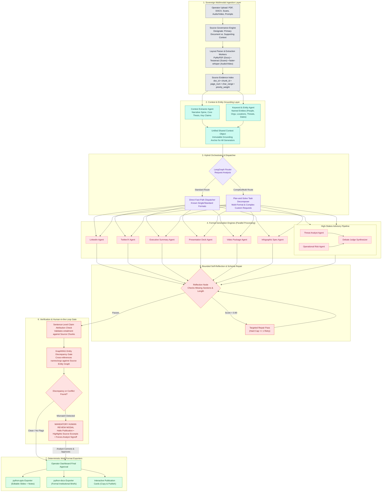

# Specification Part 1: System Architecture, Technology Stack & UI Framework
### SIH Problem Statement 26154 | National Technical Research Organisation (NTRO)
**Platform Name**: Sentinel-Transform (Sovereign Multi-Format Intelligence Transformation Engine)

---

## SECTION 1: SYSTEM ARCHITECTURE & MULTI-AGENT PIPELINE

### 1.1 Architectural Strategy: The Bifurcated Design
To achieve top selection in a competition with 500 teams, the architecture is structured into two complementary layers:
1. **The Operational Execution Engine (Code & Demo)**: Implemented as a **deterministic LangGraph State Machine**. It provides crash-proof execution, sub-second routing, atomic claim verification, and mandatory human review gates.
2. **The Sovereign Defense Architecture (PPT & Technical Depth)**: Formulated with **GraphRAG multi-hop knowledge graphs, multi-agent debate synthesis, and bounded self-reflection**.



### 1.2 Stage-by-Stage Architectural Breakdown
1. **Multimodal Ingestion & Source Governance**: Ingests PDF, DOCX, plaintext, scanned images (PNG/JPG), and audio/video files (MP4/WAV). Operator assigns **PRIMARY** authority ($w=1.0$) to the authoritative document and **SUPPORTING** ($w=0.5$) to secondary context.
2. **Unified Context & Entity Extraction**: Context Agent (narrative spine, timeline, findings) + Entity Agent (`spaCy` NER + LLM) merge into an immutable JSON object before generation to eliminate cross-format hallucinations.
3. **Hybrid Orchestrator**: Rule-based fast path (0 ms latency overhead) for standard single-format requests; Plan-and-Solve task decomposition for multi-format combinations.
4. **Parallel Format Generation Engines**: Seven dedicated generators executing against strict Pydantic models.
5. **Bounded Self-Reflection Loop**: Automated schema critique (mandatory sections, word-count tolerance). Capped at 1 retry to prevent infinite loops.
6. **Flagship Entity Fact-Check Hard Gate**: Extracts entities from drafts and verifies against the source index. Discrepancies **halt publication** and trigger mandatory human review.
7. **Deterministic Exporters**: Local Python compilers (`python-pptx`, `python-docx`) build editable PowerPoint decks with speaker notes and formal Word documents.

---

## SECTION 2: TECHNOLOGY STACK & HARDWARE EXECUTION POLICY

### 2.1 Complete Technology Stack Matrix

| Architectural Layer | Selected Technology | Version | Purpose & Selection Rationale |
|---|---|---|---|
| **Frontend Framework** | **React + Vite** | `React 18.x`, `Vite 5.x` | High-speed development, instant Hot Module Replacement (HMR), lightweight client-side rendering. |
| **Styling & Icons** | **Tailwind CSS + Lucide React** | `Tailwind 3.4.x`, `Lucide 0.350+` | Clean, modern defense-grade UI (dark/light theme), professional operational iconography. |
| **Backend API Framework** | **FastAPI + Uvicorn** | `FastAPI 0.110+`, `Python 3.11` | Asynchronous high-throughput REST API, automatic OpenAPI documentation, native Pydantic schema validation. |
| **Agent Orchestration** | **LangGraph** | `langgraph >= 0.2.x`, `langchain-core` | Explicit StateGraph orchestration, cyclic graph support for reflection loops, native human-in-the-loop checkpointing. |
| **Local Model Runtime** | **Ollama** | `v0.3.x` or latest Windows | Native Windows 11 executable. Provides standard OpenAI-compatible API (`http://localhost:11434/v1`). Automatic CPU/CUDA GPU offloading. |
| **Core Reasoning & LLM** | **Qwen 2.5 7B-Instruct** (or **3B**) | `q4_K_M` GGUF | State-of-the-art open model for structured JSON adherence, reasoning, and multilingual capability (strong Hindi/regional support). |
| **Document Ingestion** | **PyMuPDF (`fitz`)** | `PyMuPDF 1.24.x` | Fastest PDF parser on CPU; extracts page numbers, character ranges, and document layout metadata. |
| **DOCX Parsing** | **python-docx** | `python-docx 1.1.x` | Paragraph and table extraction with structure preservation. |
| **Image & Scan OCR** | **pytesseract / Tesseract OCR** | `Tesseract 5.x` | Local, CPU-efficient optical character recognition for scanned reports. |
| **Speech-to-Text (ASR)** | **faster-whisper** | `faster-whisper 1.0.x` | CTranslate2-based Whisper implementation; transcribes a 1-minute audio brief in ~3 seconds on CPU. |
| **Entity Extraction (NER)** | **spaCy** | `spaCy 3.7.x` (`en_core_web_sm`) | Ultra-fast rule/statistical entity extraction (<20ms on CPU). Identifies PERSON, ORG, GPE, DATE. |
| **Entity Matching Engine** | **RapidFuzz** | `rapidfuzz 3.8.x` | High-speed C++ Levenshtein and Jaro-Winkler string similarity for entity fuzzy matching. |
| **Knowledge Graph** | **NetworkX** | `networkx 3.2.x` | In-memory graph library for entity co-occurrence and multi-hop relationship verification. Zero DB server overhead. |
| **Presentation Exporter** | **python-pptx** | `python-pptx 0.6.x` | Generates native Microsoft PowerPoint (`.pptx`) decks with slides, shapes, bullet points, and speaker notes. |
| **Document Exporter** | **python-docx / ReportLab** | `python-docx 1.1.x` | Generates publication-ready Microsoft Word (`.docx`) and PDF advisory documents. |
| **Persistence & Audit** | **SQLite + SQLAlchemy** | `SQLite 3` | Zero-configuration local database storing transformation jobs, audit trails, and human-in-the-loop decisions. |

### 2.2 Hardware Strategy: Windows 11 CPU-First $\rightarrow$ RTX 3050 Seamless Portability
By utilizing **Ollama** as the local model host, code portability between CPU and GPU is **100% transparent**:
- On Windows 11 CPU: Ollama automatically compiles and executes using **AVX2 / AVX-512 CPU instructions**.
- On RTX 3050 GPU: Ollama detects **NVIDIA CUDA** and offloads model layers to GPU VRAM automatically.
- **Zero code changes** in Python or React. Both communicate with `http://localhost:11434/v1`.

```
[Development Phase: Windows 11 CPU Only]
Model: qwen2.5:3b (Q4_K_M, ~2.2 GB RAM)
Speed: ~18 - 25 tokens/sec | Output Latency: ~4 - 6s per format

[Demo Recording & Evaluation Phase: RTX 3050 GPU]
Model: qwen2.5:7b (Q4_K_M, ~4.8 GB VRAM)
Speed: ~35 - 45 tokens/sec | Output Latency: ~7 - 9s per format
```

| Hardware Mode | Model & Precision | Memory Usage | Speed | Latency for 300 tokens |
|---|---|---|---|---|
| **RTX 3050 (6GB/8GB VRAM)** | **Qwen 2.5 7B** (`Q4_K_M`) | ~4.8 GB VRAM | **~35–45 tok/s** | **~7–9 seconds** |
| **RTX 3050 (4GB VRAM Laptop)** | **Qwen 2.5 7B** (Partial offload) | 3.5GB VRAM + 2GB RAM | **~14–20 tok/s** | **~15–22 seconds** |
| **RTX 3050 (4GB VRAM Laptop)** | **Qwen 2.5 3B** (100% VRAM) | ~2.2 GB VRAM | **~50–65 tok/s** | **~4–6 seconds** |
| **CPU Only (Pure RAM, AVX2)** | **Qwen 2.5 7B** (`Q4_K_M`) | ~5.5 GB System RAM | **~6–10 tok/s** | **~35–45 seconds** |
| **CPU Only (Pure RAM, AVX2)** | **Qwen 2.5 3B** (`Q4_K_M`) | ~2.8 GB System RAM | **~18–25 tok/s** | **~12–16 seconds** |

### 2.3 Data Sovereignty & Air-Gapped Security Guarantee
1. **Zero Outbound Sockets**: All network traffic is blocked from leaving `localhost`.
2. **Localhost-Bound Services**: FastAPI and Ollama bind exclusively to `127.0.0.1`.
3. **Local Multilingual Inference**: Translations run inside Qwen 2.5; zero third-party translation endpoints.
4. **Complete Local Audit Trail**: SQLite database logs inputs, outputs, timestamps, and human review actions.

---

## SECTION 3: PARAMETER FRAMEWORK & UI/UX SPECIFICATION

### 3.1 Complete Parameter Matrix (From Handwritten Specification)

```
+---------------------------------------------------------------------------------------------------------+
|                                    OPERATOR PARAMETER SPECIFICATION MATRIX                              |
+----+-----------------------+---------------------+-------------------------------+----------------------+
| #  | Parameter             | Mode (S/P/Options)  | Description                   | Backend Resolution   |
+----+-----------------------+---------------------+-------------------------------+----------------------+
| 1  | Tone                  | Slider (S) /        | Slider: Formal <-> Casual     | Mapped to prompt     |
|    |                       | Prompt (P)          | Prompt: Custom voice override | system instructions  |
+----+-----------------------+---------------------+-------------------------------+----------------------+
| 2  | Audience              | Slider (S) /        | Slider: Tech, Exec, Media, Gen| Formats framing and  |
|    |                       | Prompt (P)          | Prompt: Custom target persona | jargon levels        |
+----+-----------------------+---------------------+-------------------------------+----------------------+
| 3  | Detail                | Slider (S) /        | Slider: High, Medium, Low     | Sets depth and       |
|    |                       | Prompt (P)          | Prompt: Custom depth guidance | claim count density  |
+----+-----------------------+---------------------+-------------------------------+----------------------+
| 4  | Words (Length Target) | Slider (S) /        | Target length range           | Soft target; checks  |
|    |                       | Prompt (P)          | (e.g. 150 - 1500 words)       | post-generation      |
+----+-----------------------+---------------------+-------------------------------+----------------------+
| 5  | Priority Doc          | Rank / Check /      | When multiple docs submitted: | Primary doc gets     |
|    |                       | Prompt              | Check: Mark one PRIMARY       | authority weight 1.0 |
|    |                       |                     | Rank: 1st, 2nd, 3rd           | Supporting gets 0.5  |
+----+-----------------------+---------------------+-------------------------------+----------------------+
| 6  | Objective             | Options (Gen vs.    | Generative: Creative drafting | Sets generation mode |
|    |                       | Heuristic) / Prompt | Heuristic: Strict schema-fill | in agent prompt      |
+----+-----------------------+---------------------+-------------------------------+----------------------+
| 7  | Language & Formality  | Selector / Prompt / | Language selector (English,   | Multilingual prompt  |
|    |                       | Slider              | Hindi, etc.) + Formality      | modifier             |
+----+-----------------------+---------------------+-------------------------------+----------------------+
| 8  | Keywords Must         | Auto (Gen-RAG) /    | Ensures mandatory terms       | Injected constraint; |
|    | (Optional)            | Manual w/ Frequency | appear in output              | verified post-gen    |
+----+-----------------------+---------------------+-------------------------------+----------------------+
| 9  | Add-On Instruction    | Free Prompt (P)     | Catch-all operator guidance   | Appended to prompt   |
+----+-----------------------+---------------------+-------------------------------+----------------------+
| 10 | Fact Matching Gate    | Toggle / Hard Gate  | Graph-based entity check for  | Enforces mandatory   |
|    |                       |                     | Names/Orgs -> HUMAN-IN-LOOP   | review on mismatch   |
+----+-----------------------+---------------------+-------------------------------+----------------------+
| 11 | Expected Output Time  | Dynamic Display     | Real-time estimated latency   | Calculated based on  |
|    |                       | Readout             | (e.g. "~12s on RTX 3050")     | hardware & formats   |
+----+-----------------------+---------------------+-------------------------------+----------------------+
```

### 3.2 Format-Aware Configuration Resolver
Global parameters are resolved into format-specific constraints:
```python
def resolve_format_parameters(global_params: GlobalParams, format_type: str) -> dict:
    resolved = global_params.model_dump()
    if format_type == "advisory":
        resolved["tone"] = "Authoritative, Objective, Technical"
        resolved["objective"] = "heuristic"  # Strict schema fill
    elif format_type == "twitter":
        resolved["max_characters_per_post"] = 280
        if global_params.tone == "Formal":
            resolved["tone"] = "Clear, Direct, Professional"
    elif format_type == "presentation":
        resolved["layout_type"] = "SlideDeck"
    return resolved
```

### 3.3 Operational Dashboard Wireframe & UI Layout

```
+---------------------------------------------------------------------------------------------------------+
| [LOGO] SENTINEL-TRANSFORM  |  NTRO Operational Dashboard  | [AIR-GAPPED: LOCALHOST] [HARDWARE: RTX 3050] |
+---------------------------------------------------------------------------------------------------------+
| LEFT PANEL: INGESTION & CONTROLS                | RIGHT PANEL: ARTIFACT PREVIEW & CITATION VIEWER        |
|                                                 |                                                        |
| 1. Multimodal Ingestion Dropzone                | Output Format Tabs:                                    |
|    +---------------------------------------+    | [Advisory] [LinkedIn] [Twitter] [PPTX] [Exec] [Video]  |
|    | Drag & drop PDF, DOCX, PNG, MP4, Audio|    |                                                        |
|    | [Uploaded: GhostLatch_Report.pdf (P)] |    | +----------------------------------------------------+ |
|    | [Uploaded: Regional_News_Brief.txt (S)]|    | | NATIONAL CYBER ADVISORY: GHOSTLATCH MALWARE      | |
|    +---------------------------------------+    | | Ref ID: ADV-2026-0941        Date: 11 Sept 2026    | |
|                                                 | |                                                    | |
| 2. Parameter Controls (Sliders & Prompts)       | | 1. Threat Overview:                                | |
|    Tone:     [Formal ----x---- Casual] (Slider) | | A persistence-focused malware strain designated     | |
|              [Custom prompt override...     ]   | | "GhostLatch" has targeted regional power control   | |
|    Audience: [Public -x- Tech -- Exec -- Media] | | systems [Ref: Page 2, §3].                         | |
|    Detail:   [Low ------ Medium ------x-- High] | |                                                    | |
|    Words:    [Target Range: 500w            ]   | | 2. Indicators of Compromise (IOCs):                | |
|    Objective:[ Generative ]  [X Heuristic-Fill] | | • Task Name: ScheduledUpdate_v2                    | |
|    Language: [ English (Default)           v]   | | • C2 Beacon: 198.51.100.44:8443 [Ref: Page 4, §1] | |
|    Add-On:   [Include MITRE ATT&CK mappings ]   | +----------------------------------------------------+ |
|                                                 |                                                        |
| 3. Output Format Selector (Multi-Select)        | [Action Buttons]                                       |
|    [X] Advisory       [X] Executive Summary     | [Download .DOCX]  [Download .PPTX]  [Copy to Clipboard]|
|    [X] Presentation   [ ] Video Package         |                                                        |
|    [X] LinkedIn       [X] Twitter/X Thread      | ------------------------------------------------------ |
|                                                 | SOURCE CITATION HIGHLIGHTER DRAWER (Page 2):           |
| [Expected Output Time: ~14s on RTX 3050 GPU   ] | "...The Cyber Resilience Unit confirmed that the       |
|                                                 | intrusion used a persistence technique via scheduled   |
| [ >>> EXECUTE MULTI-FORMAT TRANSFORMATION <<< ] | task manipulation..." [Highlighted in neon yellow]     |
+---------------------------------------------------------------------------------------------------------+
```

### 3.4 The Climax UI Element: Mandatory Hard Gate Modal
```
+---------------------------------------------------------------------------------------------------------+
|                               ⚠️ MANDATORY HUMAN REVIEW GATE TRIGGERED                                  |
+---------------------------------------------------------------------------------------------------------+
| An entity discrepancy was detected between the generated draft and the authoritative source document.    |
| Publication has been suspended until reviewed and verified by the analyst.                             |
|                                                                                                         |
| Deliverable Affected: Intelligence Advisory (Section 1: Threat Overview)                              |
|                                                                                                         |
| Detected Entity in Draft:                                                                               |
|   "Directorate of Grid Power Resilience"  <-- [MISMATCH / HIGH SIMILARITY TO SOURCE]                    |
|                                                                                                         |
| Verified Entity in Source Document (Page 3, Paragraph 2):                                               |
|   "Directorate of Power Grid Resilience"  [Confidence Match: 98.2%]                                     |
|                                                                                                         |
| Source Context Excerpt:                                                                                 |
|   "...The Directorate of Power Grid Resilience recommends an immediate audit of scheduled tasks..."     |
|                                                                                                         |
| Action Required:                                                                                        |
|   [ Accept Source Correction ("Directorate of Power Grid Resilience") ]                                 |
|   [ Keep Current Draft Name (Requires Written Justification)          ]                                 |
|   [ Manually Edit Entity                                              ]                                 |
+---------------------------------------------------------------------------------------------------------+
```
