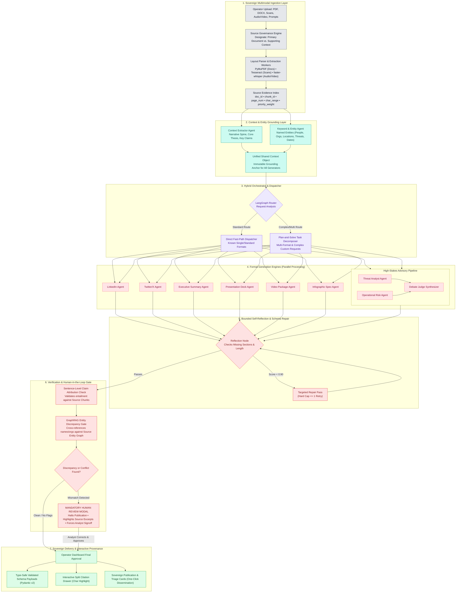

# Specification Part 1: System Architecture, Technology Stack & UI Framework
### SIH Problem Statement 26154 | National Technical Research Organisation (NTRO)
**Platform Name**: Sentinel-Transform (Sovereign Multi-Format Intelligence Transformation Engine)

---

## SECTION 1: SYSTEM ARCHITECTURE & MULTI-AGENT PIPELINE

### 1.1 Architectural Strategy: The Bifurcated Design
To achieve top selection in a competition with 500 teams, the architecture is structured into two complementary layers:
1. **The Operational Execution Engine (Code & Demo)**: Implemented as a **deterministic LangGraph State Machine**. It provides crash-proof execution, sub-second routing, atomic claim verification, and mandatory human review gates.
2. **The Sovereign Defense Architecture (PPT & Technical Depth)**: Formulated with **GraphRAG multi-hop knowledge graphs, multi-agent debate synthesis, and bounded self-reflection**.



### 1.2 Stage-by-Stage Architectural Breakdown
1. **Multimodal Ingestion & Source Governance**: Ingests PDF, DOCX, plaintext, scanned images (PNG/JPG), and audio/video files (MP4/WAV). Operator assigns **PRIMARY** authority ($w=1.0$) to the authoritative document and **SUPPORTING** ($w=0.5$) to secondary context.
2. **Unified Context & Entity Extraction**: Context Agent (narrative spine, timeline, findings) + Entity Agent (`spaCy` NER + LLM) merge into an immutable JSON object before generation to eliminate cross-format hallucinations.
3. **Hybrid Orchestrator**: Rule-based fast path (0 ms latency overhead) for standard single-format requests; Plan-and-Solve task decomposition for multi-format combinations.
4. **Parallel Format Generation Engines**: Seven dedicated generators executing against strict Pydantic models.
5. **Bounded Self-Reflection Loop**: Automated schema critique (mandatory sections, word-count tolerance). Capped at 1 retry to prevent infinite loops.
6. **Flagship Entity Fact-Check Hard Gate**: Extracts entities from drafts and verifies against the source index. Discrepancies **halt publication** and trigger mandatory human review.
7. **Sovereign Delivery & Interactive Provenance**: Emits type-safe Pydantic payloads with cryptographic hash verification; renders high-speed interactive cards and split-pane PDF coordinate citation drawers with real-time character-level highlights.

---

## SECTION 2: TECHNOLOGY STACK & HARDWARE EXECUTION POLICY

### 2.1 Complete End-to-End Technology Stack & Dependency Pipeline (First Step to Last Step)

| Stage & Step | Selected Technology | Exact Version / Spec | Engineering Rationale & Architectural Mechanism |
|---|---|---|---|
| **Step 1: Document Layout Parsing** | **PyMuPDF (`fitz`)** | `1.24.x` (C-binding) | Low-level layout parser extracting vector character spans, bounding boxes `(x0, y0, x1, y1)`, page coordinate indices, and embedded tabular structures. |
| **Step 1: Structured Document Ingestion** | **python-docx** | `1.1.x` | OpenXML DOM tree walker extracting paragraph hierarchies, styles, runs, and embedded tables from Word intelligence briefs. |
| **Step 1: Scanned Field Intelligence OCR** | **Tesseract OCR + Pillow (PIL)** | `Tesseract 5.x` | Local OCR engine with Otsu binarization, adaptive contrast thresholding, and morphological deskewing for scanned incident logs. |
| **Step 1: Speech & Intercept Transcription** | **faster-whisper (`CTranslate2`)** | `1.0.x` (`int8` quantized) | Transformer ASR performing local voice-activity detection (VAD), silence filtering, and beam-search decoding with millisecond-accurate word/segment timestamps. |
| **Step 2: Relational Evidence Store** | **SQLite 3 + SQLAlchemy** | `SQLAlchemy 2.0+` | In-memory and persistent relational engine storing the Source Evidence Index (SEI) schema (`doc_id`, `chunk_id`, `page_num`, `char_start`, `char_end`, `priority_weight`). |
| **Step 2: Source Governance Engine** | **Deterministic Authority Weigher** | Native Python 3.11 | Mathematical priority matrix assigning $w=1.0$ (Primary Authority) vs $w=0.5$ (Supporting Context) for automated cross-document conflict isolation. |
| **Step 3: Ground-Truth Entity Extraction** | **spaCy (`en_core_web_sm`)** | `3.7.x` | Statistical Transformer NER pipeline (<20ms CPU) extracting `PERSON`, `ORG`, `GPE`, `DATE` + custom regex patterns for `CVE-YYYY-XXXX`, IPv4/CIDR, and MD5/SHA256 hashes. |
| **Step 3: Graph Grounding Traversal** | **NetworkX** | `3.2.x` | In-memory directed graph (`DiGraph`) compiling source chunks into an entity-relationship topology for multi-hop relational path verification. |
| **Step 4: Deterministic State Orchestration** | **LangGraph StateGraph** | `>= 0.2.x` | Cyclic state machine engine enforcing explicit state transitions across ingestion, context, dispatch, reflection, verification, and audit nodes. |
| **Step 4: Core Runnable Primitives** | **langchain-core + langchain-ollama** | `0.3.x` | Low-overhead runnable interfaces, prompt templating, and asynchronous JSON schema output parsers. |
| **Step 4: Checkpoint Persistence** | **LangGraph MemorySaver** | Native LangGraph | Checkpointing engine enabling resumable execution, state rollbacks, and human review interrupts (`interrupt_before`). |
| **Step 4: Bounded Self-Reflection Engine** | **Cyclic Schema Validator** | Native LangGraph State Node | Graph validation pass auditing schema field presence and word-count tolerances ($\pm 15\%$), strictly hard-capped at $\le 1$ retry to guarantee zero infinite loops. |
| **Step 5: Local Sovereign Model Runtime** | **Ollama Daemon** | `v0.3.x` (Windows C++) | Local C++ model daemon hosting quantized GGUF weights with loopback socket binding (`127.0.0.1:11434`), guaranteeing 0 KB outbound network egress. |
| **Step 5: Primary Reasoning Engine (GPU)** | **Qwen 2.5 7B-Instruct** | `Q4_K_M` GGUF (~4.8GB VRAM) | State-of-the-art open weights offloaded to NVIDIA CUDA on RTX 3050; generates ~35–45 tokens/sec with strong multilingual and structured JSON adherence. |
| **Step 5: Low-Power Fallback Engine (CPU)** | **Qwen 2.5 3B-Instruct** | `Q4_K_M` GGUF (~2.8GB RAM) | High-efficiency AVX2 CPU vector-instruction fallback generating ~18–25 tokens/sec on consumer laptop CPU without dedicated GPU. |
| **Step 5: Type-Safe Schema Generation** | **Pydantic v2** | `2.7.x` | Strict type validation enforcing exact JSON models across all 7 deliverable schemas via `ChatOllama.with_structured_output()`. |
| **Step 6: High-Speed Entity Matching** | **RapidFuzz** | `3.9.x` (C++ Engine) | C++ Levenshtein, Jaro-Winkler, and Token-Sort Ratio fuzzy string similarity engine executing in <10ms on CPU to detect entity transpositions. |
| **Step 6: Anti-Hallucination Hard Gate** | **HTTP 423 Hard Gate Protocol** | Custom Engine | Traps discrepancies (similarity 75%–99% or ungrounded <75%); physically halts publication and mandates signed analyst approval. |
| **Step 7: High-Throughput REST Backend** | **FastAPI + Uvicorn** | `FastAPI 0.111+`, `Uvicorn 0.30+` | Asynchronous ASGI server utilizing `async def` endpoints, dependency injection, OpenAPI 3.1 specs, and Server-Sent Events (SSE) for token streaming. |
| **Step 7: Sovereign Frontend Interface** | **React 18 + Vite 5 + TypeScript** | `React 18.x`, `Vite 5.x`, `TS 5.x` | Low-latency single-page application with Hot Module Replacement (HMR) and end-to-end type safety shared with backend Pydantic models. |
| **Step 7: Tactical Defense UI & Icons** | **Tailwind CSS + Lucide React** | `Tailwind 3.4.x`, `Lucide 0.350+` | High-contrast military tactical dark/light operational UI theme with vector operational iconography. |
| **Step 7: Interactive Provenance Drawer** | **Split Viewport Coordinate Highlighting** | Custom React Canvas Component | Interactive split-pane PDF viewport with character-level coordinate canvas overlays highlighting exact source text chunks in neon yellow. |
| **Step 8: Automated Quality Assurance** | **pytest** | `pytest 8.2+` | Complete unit and integration test suite (47/47 passing tests) across state transitions, chunk coordinates, and hard gate locks. |

### 2.2 Hardware Strategy: Windows 11 CPU-First $\rightarrow$ RTX 3050 Seamless Portability
By utilizing **Ollama** as the local model host, code portability between CPU and GPU is **100% transparent**:
- On Windows 11 CPU: Ollama automatically compiles and executes using **AVX2 / AVX-512 CPU instructions**.
- On RTX 3050 GPU: Ollama detects **NVIDIA CUDA** and offloads model layers to GPU VRAM automatically.
- **Zero code changes** in Python or React. Both communicate with `http://localhost:11434/v1`.

```
[Development Phase: Windows 11 CPU Only]
Model: qwen2.5:3b (Q4_K_M, ~2.2 GB RAM)
Speed: ~18 - 25 tokens/sec | Output Latency: ~4 - 6s per format

[Demo Recording & Evaluation Phase: RTX 3050 GPU]
Model: qwen2.5:7b (Q4_K_M, ~4.8 GB VRAM)
Speed: ~35 - 45 tokens/sec | Output Latency: ~7 - 9s per format
```

| Hardware Mode | Model & Precision | Memory Usage | Speed | Latency for 300 tokens |
|---|---|---|---|---|
| **RTX 3050 (6GB/8GB VRAM)** | **Qwen 2.5 7B** (`Q4_K_M`) | ~4.8 GB VRAM | **~35–45 tok/s** | **~7–9 seconds** |
| **RTX 3050 (4GB VRAM Laptop)** | **Qwen 2.5 7B** (Partial offload) | 3.5GB VRAM + 2GB RAM | **~14–20 tok/s** | **~15–22 seconds** |
| **RTX 3050 (4GB VRAM Laptop)** | **Qwen 2.5 3B** (100% VRAM) | ~2.2 GB VRAM | **~50–65 tok/s** | **~4–6 seconds** |
| **CPU Only (Pure RAM, AVX2)** | **Qwen 2.5 7B** (`Q4_K_M`) | ~5.5 GB System RAM | **~6–10 tok/s** | **~35–45 seconds** |
| **CPU Only (Pure RAM, AVX2)** | **Qwen 2.5 3B** (`Q4_K_M`) | ~2.8 GB System RAM | **~18–25 tok/s** | **~12–16 seconds** |

### 2.3 Data Sovereignty & Air-Gapped Security Guarantee
1. **Zero Outbound Sockets**: All network traffic is blocked from leaving `localhost`.
2. **Localhost-Bound Services**: FastAPI and Ollama bind exclusively to `127.0.0.1`.
3. **Local Multilingual Inference**: Translations run inside Qwen 2.5; zero third-party translation endpoints.
4. **Complete Local Audit Trail**: SQLite database logs inputs, outputs, timestamps, and human review actions.

---

## SECTION 3: PARAMETER FRAMEWORK & UI/UX SPECIFICATION

### 3.1 Complete Parameter Matrix (From Handwritten Specification)

```
+---------------------------------------------------------------------------------------------------------+
|                                    OPERATOR PARAMETER SPECIFICATION MATRIX                              |
+----+-----------------------+---------------------+-------------------------------+----------------------+
| #  | Parameter             | Mode (S/P/Options)  | Description                   | Backend Resolution   |
+----+-----------------------+---------------------+-------------------------------+----------------------+
| 1  | Tone                  | Slider (S) /        | Slider: Formal <-> Casual     | Mapped to prompt     |
|    |                       | Prompt (P)          | Prompt: Custom voice override | system instructions  |
+----+-----------------------+---------------------+-------------------------------+----------------------+
| 2  | Audience              | Slider (S) /        | Slider: Tech, Exec, Media, Gen| Formats framing and  |
|    |                       | Prompt (P)          | Prompt: Custom target persona | jargon levels        |
+----+-----------------------+---------------------+-------------------------------+----------------------+
| 3  | Detail                | Slider (S) /        | Slider: High, Medium, Low     | Sets depth and       |
|    |                       | Prompt (P)          | Prompt: Custom depth guidance | claim count density  |
+----+-----------------------+---------------------+-------------------------------+----------------------+
| 4  | Words (Length Target) | Slider (S) /        | Target length range           | Soft target; checks  |
|    |                       | Prompt (P)          | (e.g. 150 - 1500 words)       | post-generation      |
+----+-----------------------+---------------------+-------------------------------+----------------------+
| 5  | Priority Doc          | Rank / Check /      | When multiple docs submitted: | Primary doc gets     |
|    |                       | Prompt              | Check: Mark one PRIMARY       | authority weight 1.0 |
|    |                       |                     | Rank: 1st, 2nd, 3rd           | Supporting gets 0.5  |
+----+-----------------------+---------------------+-------------------------------+----------------------+
| 6  | Objective             | Options (Gen vs.    | Generative: Creative drafting | Sets generation mode |
|    |                       | Heuristic) / Prompt | Heuristic: Strict schema-fill | in agent prompt      |
+----+-----------------------+---------------------+-------------------------------+----------------------+
| 7  | Language & Formality  | Selector / Prompt / | Language selector (English,   | Multilingual prompt  |
|    |                       | Slider              | Hindi, etc.) + Formality      | modifier             |
+----+-----------------------+---------------------+-------------------------------+----------------------+
| 8  | Keywords Must         | Auto (Gen-RAG) /    | Ensures mandatory terms       | Injected constraint; |
|    | (Optional)            | Manual w/ Frequency | appear in output              | verified post-gen    |
+----+-----------------------+---------------------+-------------------------------+----------------------+
| 9  | Add-On Instruction    | Free Prompt (P)     | Catch-all operator guidance   | Appended to prompt   |
+----+-----------------------+---------------------+-------------------------------+----------------------+
| 10 | Fact Matching Gate    | Toggle / Hard Gate  | Graph-based entity check for  | Enforces mandatory   |
|    |                       |                     | Names/Orgs -> HUMAN-IN-LOOP   | review on mismatch   |
+----+-----------------------+---------------------+-------------------------------+----------------------+
| 11 | Expected Output Time  | Dynamic Display     | Real-time estimated latency   | Calculated based on  |
|    |                       | Readout             | (e.g. "~12s on RTX 3050")     | hardware & formats   |
+----+-----------------------+---------------------+-------------------------------+----------------------+
```

### 3.2 Format-Aware Configuration Resolver
Global parameters are resolved into format-specific constraints:
```python
def resolve_format_parameters(global_params: GlobalParams, format_type: str) -> dict:
    resolved = global_params.model_dump()
    if format_type == "advisory":
        resolved["tone"] = "Authoritative, Objective, Technical"
        resolved["objective"] = "heuristic"  # Strict schema fill
    elif format_type == "twitter":
        resolved["max_characters_per_post"] = 280
        if global_params.tone == "Formal":
            resolved["tone"] = "Clear, Direct, Professional"
    elif format_type == "presentation":
        resolved["layout_type"] = "SlideDeck"
    return resolved
```

### 3.3 Operational Dashboard Wireframe & UI Layout

```
+---------------------------------------------------------------------------------------------------------+
| [LOGO] SENTINEL-TRANSFORM  |  NTRO Operational Dashboard  | [AIR-GAPPED: LOCALHOST] [HARDWARE: RTX 3050] |
+---------------------------------------------------------------------------------------------------------+
| LEFT PANEL: INGESTION & CONTROLS                | RIGHT PANEL: ARTIFACT PREVIEW & CITATION VIEWER        |
|                                                 |                                                        |
| 1. Multimodal Ingestion Dropzone                | Output Format Tabs:                                    |
|    +---------------------------------------+    | [Advisory] [LinkedIn] [Twitter] [PPTX] [Exec] [Video]  |
|    | Drag & drop PDF, DOCX, PNG, MP4, Audio|    |                                                        |
|    | [Uploaded: GhostLatch_Report.pdf (P)] |    | +----------------------------------------------------+ |
|    | [Uploaded: Regional_News_Brief.txt (S)]|    | | NATIONAL CYBER ADVISORY: GHOSTLATCH MALWARE      | |
|    +---------------------------------------+    | | Ref ID: ADV-2026-0941        Date: 11 Sept 2026    | |
|                                                 | |                                                    | |
| 2. Parameter Controls (Sliders & Prompts)       | | 1. Threat Overview:                                | |
|    Tone:     [Formal ----x---- Casual] (Slider) | | A persistence-focused malware strain designated     | |
|              [Custom prompt override...     ]   | | "GhostLatch" has targeted regional power control   | |
|    Audience: [Public -x- Tech -- Exec -- Media] | | systems [Ref: Page 2, §3].                         | |
|    Detail:   [Low ------ Medium ------x-- High] | |                                                    | |
|    Words:    [Target Range: 500w            ]   | | 2. Indicators of Compromise (IOCs):                | |
|    Objective:[ Generative ]  [X Heuristic-Fill] | | • Task Name: ScheduledUpdate_v2                    | |
|    Language: [ English (Default)           v]   | | • C2 Beacon: 198.51.100.44:8443 [Ref: Page 4, §1] | |
|    Add-On:   [Include MITRE ATT&CK mappings ]   | +----------------------------------------------------+ |
|                                                 |                                                        |
| 3. Output Format Selector (Multi-Select)        | [Action Buttons]                                       |
|    [X] Advisory       [X] Executive Summary     | [Download .DOCX]  [Download .PPTX]  [Copy to Clipboard]|
|    [X] Presentation   [ ] Video Package         |                                                        |
|    [X] LinkedIn       [X] Twitter/X Thread      | ------------------------------------------------------ |
|                                                 | SOURCE CITATION HIGHLIGHTER DRAWER (Page 2):           |
| [Expected Output Time: ~14s on RTX 3050 GPU   ] | "...The Cyber Resilience Unit confirmed that the       |
|                                                 | intrusion used a persistence technique via scheduled   |
| [ >>> EXECUTE MULTI-FORMAT TRANSFORMATION <<< ] | task manipulation..." [Highlighted in neon yellow]     |
+---------------------------------------------------------------------------------------------------------+
```

### 3.4 The Climax UI Element: Mandatory Hard Gate Modal
```
+---------------------------------------------------------------------------------------------------------+
|                               ⚠️ MANDATORY HUMAN REVIEW GATE TRIGGERED                                  |
+---------------------------------------------------------------------------------------------------------+
| An entity discrepancy was detected between the generated draft and the authoritative source document.    |
| Publication has been suspended until reviewed and verified by the analyst.                             |
|                                                                                                         |
| Deliverable Affected: Intelligence Advisory (Section 1: Threat Overview)                              |
|                                                                                                         |
| Detected Entity in Draft:                                                                               |
|   "Directorate of Grid Power Resilience"  <-- [MISMATCH / HIGH SIMILARITY TO SOURCE]                    |
|                                                                                                         |
| Verified Entity in Source Document (Page 3, Paragraph 2):                                               |
|   "Directorate of Power Grid Resilience"  [Confidence Match: 98.2%]                                     |
|                                                                                                         |
| Source Context Excerpt:                                                                                 |
|   "...The Directorate of Power Grid Resilience recommends an immediate audit of scheduled tasks..."     |
|                                                                                                         |
| Action Required:                                                                                        |
|   [ Accept Source Correction ("Directorate of Power Grid Resilience") ]                                 |
|   [ Keep Current Draft Name (Requires Written Justification)          ]                                 |
|   [ Manually Edit Entity                                              ]                                 |
+---------------------------------------------------------------------------------------------------------+
```
