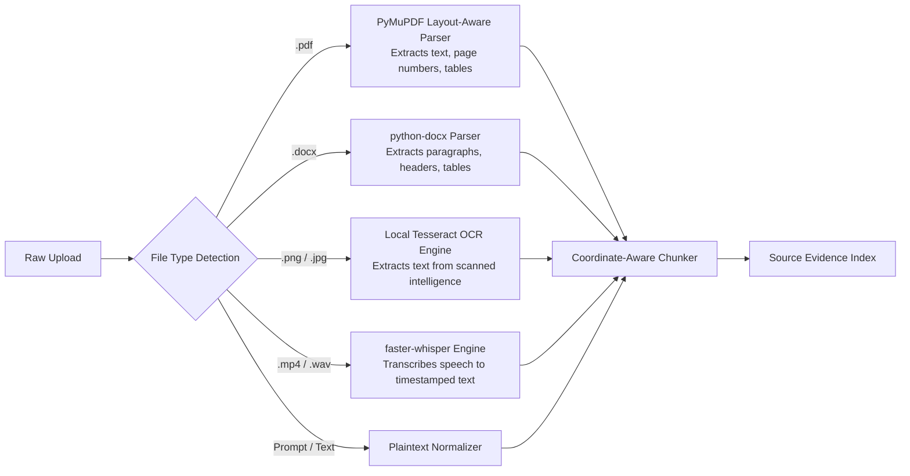
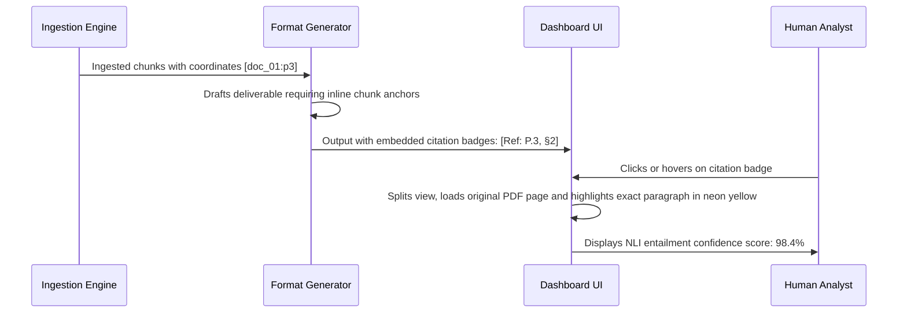
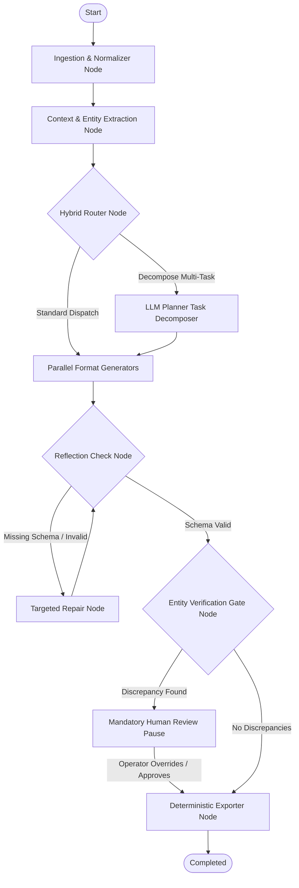

# Specification Part 2: Ingestion Engine, Schemas & LangGraph Orchestration
### SIH Problem Statement 26154 | National Technical Research Organisation (NTRO)
**Platform Name**: Sentinel-Transform (Sovereign Multi-Format Intelligence Transformation Engine)

---

## SECTION 1: INGESTION, SOURCE GOVERNANCE & EVIDENCE ATTRIBUTION

### 1.1 Multimodal Ingestion Pipeline
The platform ingests heterogeneous unstructured intelligence formats and normalizes them into clean, structured, coordinate-indexed text chunks.



#### Parsing Specifications:
1. **PDF Documents (`PyMuPDF`)**: Iterates through pages preserving page boundaries, bounding boxes, and character offsets.
2. **DOCX Files (`python-docx`)**: Preserves section hierarchy (headings, body paragraphs, tables).
3. **Scanned Images & Threat Diagrams (`Tesseract OCR`)**: Pre-processed with contrast enhancement and grayscale conversion before OCR.
4. **Audio Briefs & Video Intercepts (`faster-whisper`)**: Uses `small` model on CPU/GPU to generate timestamped text segments (`[00:14 - 00:28]`).

### 1.2 Source Governance: Primary vs. Supporting Documents
Analysts cross-reference primary classified incident reports with secondary open-source news. The platform implements **Deterministic Source Governance**:

```
+---------------------------------------------------------------------------------------------------------+
|                                    SOURCE GOVERNANCE RULES                                              |
+---------------------+-------------------------------+---------------------------------------------------+
| Source Role         | Authority Weight              | Operational Backend Rule                          |
+---------------------+-------------------------------+---------------------------------------------------+
| PRIMARY DOCUMENT    | 1.0 (Absolute Authority)      | Facts, numbers, names, and claims establish the   |
| (Exactly 1 File)    |                               | baseline truth. Cannot be overridden.             |
+---------------------+-------------------------------+---------------------------------------------------+
| SUPPORTING CONTEXT  | 0.5 (Contextual Backdrop)     | Can provide additional context or corroboration.  |
| (Optional N Files)  |                               | Any contradiction with Primary triggers a flag.   |
+---------------------+-------------------------------+---------------------------------------------------+
```

#### Conflict Resolution Logic:
- If a Supporting Document states *"14 endpoints infected"* while Primary states *"2 endpoints infected"*, the generator **prioritizes the Primary Document**, flags the numerical conflict, and appends a conflict note in the Advisory and Executive Summary for the analyst.

### 1.3 Source Evidence Index Schema
Chunks are stored in memory and SQLite with forensic coordinates:
```json
{
  "chunk_id": "doc_01_chunk_04",
  "doc_id": "doc_01",
  "source_name": "Operation_GhostLatch_Incident_Report.pdf",
  "source_role": "PRIMARY",
  "page_number": 3,
  "timestamp_start": null,
  "timestamp_end": null,
  "char_start": 1420,
  "char_end": 1890,
  "text": "The Cyber Resilience Unit confirmed that the intrusion attempt utilized an unpatched firmware vulnerability across substation control software. All affected substations have since been remediated.",
  "extracted_entities": [
    {"text": "Cyber Resilience Unit", "label": "ORG"},
    {"text": "substation control software", "label": "TECH"}
  ]
}
```

### 1.4 Forensic Sentence-Level Claim Attribution (Gap 5 Solution)
To eliminate the "generic ungrounded ChatGPT" perception, the platform enforces **Bidirectional Claim Attribution**:



1. **Schema Requirement**: Prompts require claims to output supporting `chunk_ids` and page numbers.
2. **Interactive UI Highlighting**: Hovering over `[Ref: Page 3]` opens a split drawer, scrolls to Page 3, and applies a yellow CSS highlight over characters `1420` to `1890`.
3. **Export Citations**: Footnotes in `.docx` advisories; slide footers and speaker notes in `.pptx` decks.

---

## SECTION 2: SCHEMAS & DELIVERABLE EXPORTER SPECIFICATIONS

### 2.1 Complete Pydantic Schemas for All 7 Formats

```python
from pydantic import BaseModel, Field
from typing import List

# Format 1: LinkedIn Post
class LinkedInSchema(BaseModel):
    headline: str = Field(description="Punchy, professional title/hook")
    opening_hook: str = Field(description="First 2 lines designed to stop the scroll")
    body_paragraphs: List[str] = Field(description="Core insights, formatted with spacing")
    key_takeaways: List[str] = Field(description="3-4 bulleted high-impact takeaways")
    call_to_action: str = Field(description="Professional engagement or advisory prompt")
    hashtags: List[str] = Field(description="5-8 relevant domain hashtags (#CyberSecurity, etc.)")
    cited_chunk_ids: List[str] = Field(description="Source chunk IDs supporting the claims")

# Format 2: Twitter/X Thread
class TweetItem(BaseModel):
    tweet_number: int = Field(description="Order in the thread (e.g. 1, 2, 3)")
    content: str = Field(description="Post text strictly <= 280 characters")
    character_count: int = Field(description="Exact character length")
    contains_media_placeholder: bool = Field(default=False)

class TwitterThreadSchema(BaseModel):
    thread_title: str
    total_tweets: int
    tweets: List[TweetItem]
    cited_chunk_ids: List[str]

# Format 3: Intelligence Advisory
class AdvisorySchema(BaseModel):
    advisory_id: str = Field(description="Generated reference code e.g. NTRO-ADV-2026-09")
    title: str = Field(description="Formal threat title")
    severity_level: str = Field(description="CRITICAL | HIGH | MEDIUM | LOW")
    threat_overview: str = Field(description="Detailed mechanism and threat actor attribution")
    affected_systems: List[str] = Field(description="Hardware, software, protocols targeted")
    indicators_of_compromise: List[str] = Field(description="IPs, hashes, file paths, C2 domains")
    recommended_mitigations: List[str] = Field(description="Immediate actionable countermeasures")
    compliance_and_governance: str = Field(description="Regulatory / reporting requirements")
    cited_chunk_ids: List[str]

# Format 4: Executive Summary
class ExecSummarySchema(BaseModel):
    situation_overview: str = Field(description="1-paragraph strategic briefing for leaders")
    core_findings: List[str] = Field(description="Top 3-5 critical factual discoveries")
    strategic_impact: str = Field(description="Financial, operational, or national security risk")
    decisions_required: List[str] = Field(description="Immediate executive decisions needed")
    confidence_assessment: str = Field(description="HIGH | MODERATE | LOW analytical confidence")
    cited_chunk_ids: List[str]

# Format 5: Presentation Deck
class Slide(BaseModel):
    slide_number: int
    title: str
    bullet_points: List[str] = Field(description="3-5 concise, hierarchical bullet points")
    visual_guidance: str = Field(description="Visual layout direction (e.g. 2-column chart)")
    speaker_notes: str = Field(description="Comprehensive script for the presenter")
    slide_reference_citations: List[str]

class PresentationSchema(BaseModel):
    deck_title: str
    target_audience: str
    slides: List[Slide]

# Format 6: Video Production Package
class Scene(BaseModel):
    scene_number: int
    duration_seconds: int
    visual_description: str = Field(description="On-screen visual action, b-roll, graphics")
    narration_voiceover: str = Field(description="Exact spoken narration text")
    on_screen_subtitles: str = Field(description="Lower-third subtitle text")
    music_sound_cues: str = Field(description="Audio tone and sound effects")

class VideoPackageSchema(BaseModel):
    video_title: str
    target_duration: str
    logline: str
    scenes: List[Scene]
    cited_chunk_ids: List[str]

# Format 7: Infographic Content Spec
class InfographicSection(BaseModel):
    section_order: int
    header: str
    key_statistic_or_callout: str
    descriptive_copy: str
    recommended_chart_type: str = Field(description="Bar Chart | Flowchart | Timeline | Metric Card")

class InfographicSchema(BaseModel):
    infographic_title: str
    central_theme: str
    sections: List[InfographicSection]
    cited_chunk_ids: List[str]
```

### 2.2 Type-Safe Schema Compilation & Coordinate Attribution Mapping
1. **Schema Validation & Hash Integrity**: Rather than emitting unstable free text, generators output strict Pydantic v2 JSON models. Each validated deliverable receives a computed SHA-256 fingerprint anchoring it to the exact source chunk IDs.
2. **Coordinate Attribution Mapping**: Every generated claim maps to an explicit list of supporting `cited_chunk_ids`. These IDs resolve against the Source Evidence Index (SEI) to render interactive character-level highlights across page coordinates in the operator dashboard.

---

## SECTION 3: LANGGRAPH STATE MACHINE & ORCHESTRATION

### 3.1 LangGraph State Schema (`AgentState`)
```python
from typing import TypedDict, List, Dict, Any

class AgentState(TypedDict):
    job_id: str
    uploaded_files: List[Dict[str, Any]]
    primary_doc_id: str
    source_chunks: List[Dict[str, Any]]
    context_summary: str
    extracted_entities: List[Dict[str, Any]]
    merged_context: Dict[str, Any]
    parameters: Dict[str, Any]
    requested_formats: List[str]
    draft_outputs: Dict[str, Any]
    reflection_attempts: Dict[str, int]
    claim_verifications: List[Dict[str, Any]]
    entity_discrepancies: List[Dict[str, Any]]
    hard_gate_triggered: bool
    human_approved: bool
    human_corrections: Dict[str, Any]
    exported_files: Dict[str, str]
```

### 3.2 Graph Nodes & Edge Topology



### 3.3 LangGraph State Machine Implementation Code
```python
from langgraph.graph import StateGraph, END
from langgraph.checkpoint.memory import MemorySaver

# 1. Initialize Graph
workflow = StateGraph(AgentState)

# 2. Add Processing Nodes
workflow.add_node("ingestion_node", run_ingestion_and_normalization)
workflow.add_node("context_node", run_context_and_entity_extraction)
workflow.add_node("generator_node", run_parallel_format_generation)
workflow.add_node("reflection_node", run_reflection_repair)
workflow.add_node("verification_gate_node", run_entity_and_claim_verification)
workflow.add_node("export_node", run_deterministic_exporters)

# 3. Define Flow Edges
workflow.set_entry_point("ingestion_node")
workflow.add_edge("ingestion_node", "context_node")
workflow.add_edge("context_node", "generator_node")
workflow.add_edge("generator_node", "reflection_node")

# 4. Conditional Edge: Bounded Reflection (Hard Cap <= 1 Retry)
def check_reflection(state: AgentState) -> str:
    max_retries = max(state.get("reflection_attempts", {}).values(), default=0)
    if state.get("schema_errors") and max_retries < 1:
        return "retry_reflection"
    return "proceed_to_gate"

workflow.add_conditional_edges(
    "reflection_node",
    check_reflection,
    {
        "retry_reflection": "generator_node",
        "proceed_to_gate": "verification_gate_node"
    }
)

# 5. Conditional Edge: The Flagship Hard Gate
def check_hard_gate(state: AgentState) -> str:
    if state.get("hard_gate_triggered", False) and not state.get("human_approved", False):
        return "pause_for_human"
    return "proceed_to_export"

workflow.add_conditional_edges(
    "verification_gate_node",
    check_hard_gate,
    {
        "pause_for_human": END,  # Pauses execution at checkpoint
        "proceed_to_export": "export_node"
    }
)

workflow.add_edge("export_node", END)

# 6. Compile with Checkpointer for State Persistence
memory = MemorySaver()
app = workflow.compile(
    checkpointer=memory,
    interrupt_before=["export_node"] if True else []
)
```

#### Resume Execution Semantics:
When the operator confirms or edits an entity in the UI modal, the backend calls:
```python
app.update_state(
    config={"configurable": {"thread_id": job_id}},
    values={
        "human_approved": True,
        "human_corrections": {"Directorate of Grid Power Resilience": "Directorate of Power Grid Resilience"}
    }
)
app.invoke(None, config={"configurable": {"thread_id": job_id}})
```
