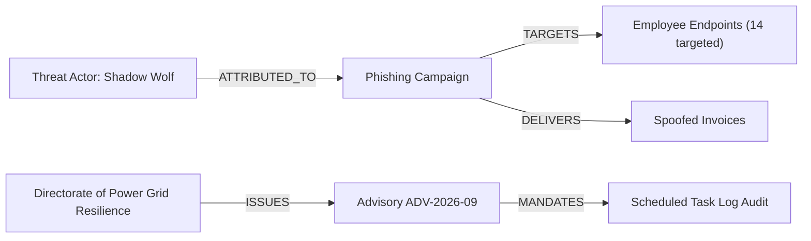
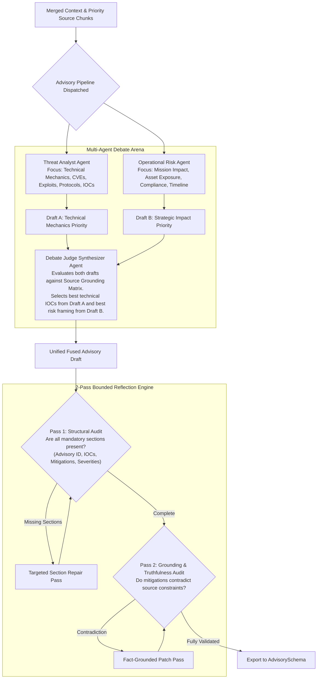
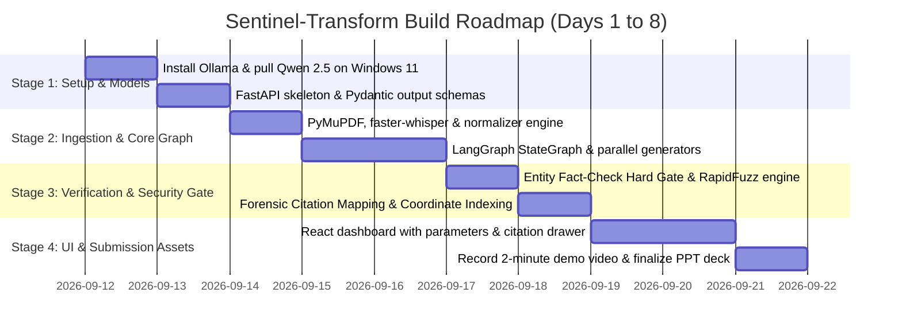

# Specification Part 3: Verification Gate, Deep Debate & Build Roadmap
### SIH Problem Statement 26154 | National Technical Research Organisation (NTRO)
**Platform Name**: Sentinel-Transform (Sovereign Multi-Format Intelligence Transformation Engine)

---

## SECTION 1: VERIFICATION GATE & GRAPHRAG ENTITY ARCHITECTURE

### 1.1 Why Simple RAG Fails in Defense Intelligence
Standard RAG architectures rely on top-$k$ semantic similarity search, which introduces critical security failures:
- **Entity Transposition**: Altering *"Directorate of Power Grid Resilience"* to *"Directorate of Grid Power Resilience"*. Vector similarity treats them as nearly identical ($\cos(\theta) > 0.96$), failing to detect the transposition error.
- **Relational Hallucination**: Associating a known threat cluster (e.g. *"Shadow Wolf"*) with an unconfirmed malware strain (e.g. *"GhostLatch"*) simply because both appeared in the same retrieval window.

**Sentinel-Transform solves this with a Dual-Layer Verification Gate:**
1. **Layer 1: Deterministic Exact/Fuzzy Entity Set Gate (Phase 1 MVP)**
2. **Layer 2: Multi-Hop GraphRAG Knowledge Traversal (Phase 2 Upgrade)**

### 1.2 Layer 1: Deterministic Entity Verification Engine
Runs locally on CPU in **under 50 milliseconds**:

```python
import spacy
from rapidfuzz import fuzz, process

nlp = spacy.load("en_core_web_sm")

def run_entity_verification(generated_text: str, source_entities: set) -> dict:
    doc = nlp(generated_text)
    draft_entities = {ent.text.strip() for ent in doc.ents if ent.label_ in ["ORG", "PERSON", "GPE"]}
    
    mismatches = []
    for draft_ent in draft_entities:
        if draft_ent in source_entities:
            continue  # Exact match -> Validated
            
        best_match, score, _ = process.extractOne(
            draft_ent, 
            source_entities, 
            scorer=fuzz.token_sort_ratio
        )
        
        # Similarity between 75% and 99% indicates a likely transposition/hallucination
        if 75 <= score < 100:
            mismatches.append({
                "draft_entity": draft_ent,
                "suggested_source_entity": best_match,
                "similarity_score": round(score, 1),
                "status": "FLAGGED_MISMATCH"
            })
        elif score < 75:
            mismatches.append({
                "draft_entity": draft_ent,
                "suggested_source_entity": None,
                "similarity_score": round(score, 1),
                "status": "UNGROUNDED_NEW_ENTITY"
            })
            
    return {
        "passed": len(mismatches) == 0,
        "mismatches": mismatches
    }
```

### 1.3 Layer 2: GraphRAG Knowledge Graph Traversal
In addition to flat entity sets, the platform compiles source chunks into an in-memory **NetworkX** knowledge graph:



#### GraphRAG Traversal Query:
When an advisory claims: *"The Directorate of Power Grid Resilience attributed GhostLatch to Shadow Wolf"*, the verification agent executes a 2-hop traversal:
1. Does node `(Directorate of Power Grid Resilience)` have an outgoing edge `[:ATTRIBUTED]` to `(Shadow Wolf)`?
2. **Result**: Traversal fails (No path exists in the source graph).
3. **Action**: Hard Gate triggered immediately: *"Relational Hallucination: Source document does not link Directorate attribution to Shadow Wolf."*

### 1.4 The Human-in-the-Loop Hard Gate Operational Contract
```
+---------------------------------------------------------------------------------------------------------+
|                                    HARD GATE OPERATIONAL PROTOCOL                                       |
+---------------------------------------------------------------------------------------------------------+
| Rule 1: Automated export endpoints (/api/export/pptx, /api/export/docx) are physically locked           |
|         whenever `hard_gate_triggered == True` and `human_approved == False`.                           |
|                                                                                                         |
| Rule 2: The system never auto-corrects silently. A silent correction in an intelligence advisory could  |
|         alter classified semantics or operational directives without human oversight.                  |
|                                                                                                         |
| Rule 3: The human analyst must take one of three explicit actions:                                      |
|         1. Click "Accept Source Correction" -> System replaces string and logs replacement.             |
|         2. Click "Override & Keep Draft"   -> Requires analyst to check "Analyst Signed Authorization".|
|         3. Click "Edit Manually"           -> Opens inline markdown editor for direct refinement.       |
+---------------------------------------------------------------------------------------------------------+
```

---

## SECTION 2: HIGH-STAKES ADVISORY PIPELINE: DEBATE & REFLECTION

### 2.1 Why High-Stakes Advisories Require Specialization
While social posts can be drafted in a single pass, an **Intelligence Advisory** directly informs critical national infrastructure defense. The platform isolates the Advisory format into a specialized **Multi-Agent Debate Subgraph**:



### 2.2 Multi-Agent Debate Prompts & Roles
1. **Threat Analyst Agent**: Focuses on attack vectors, protocol abuse, persistence mechanisms, exact IOCs, and CVEs. Tone: Exhaustive, forensic, precise.
2. **Operational Risk Agent**: Focuses on blast radius across critical infrastructure, regulatory reporting deadlines, and operational directives. Tone: Decisive, authoritative.
3. **Debate Judge Synthesizer**: Compares both drafts against the source matrix, eliminates contradictions, and fuses them into an authoritative `AdvisorySchema`.

### 2.3 The 2-Pass Bounded Reflection Loop
```python
def reflection_audit_pass(state: AgentState) -> dict:
    advisory: AdvisorySchema = state["draft_outputs"]["advisory"]
    audit_notes = []
    
    # PASS 1: STRUCTURAL AUDIT
    if not advisory.indicators_of_compromise or len(advisory.indicators_of_compromise) == 0:
        audit_notes.append("CRITICAL: Missing Indicators of Compromise (IOCs).")
    if not advisory.recommended_mitigations or len(advisory.recommended_mitigations) < 2:
        audit_notes.append("DEFICIENCY: Advisory requires at least 2 actionable remediation steps.")
        
    # PASS 2: GROUNDING AUDIT
    for action in advisory.recommended_mitigations:
        if "third-party cloud scanner" in action.lower():
            audit_notes.append("VIOLATION: Air-gapped defense prohibits cloud-based scanning tools.")
            
    return {"passed": len(audit_notes) == 0, "audit_notes": audit_notes}
```
- **Bounding Policy**: If `reflection_attempts >= 1`, the loop forces forward progress and routes remaining ambiguities directly to the human review gate.

---

## SECTION 3: STEP-BY-STEP IMPLEMENTATION & BUILD ROADMAP

### 3.1 Project Implementation Timeline Overview



### 3.2 Phase-by-Phase Build Instructions

#### Phase 1: Environment Setup & Local Model Verification (Day 1)
```powershell
# 1. Verify Ollama on Windows 11
ollama --version

# 2. Pull CPU development model and RTX 3050 demo model
ollama pull qwen2.5:3b
ollama pull qwen2.5:7b

# 3. Setup Python virtual environment
python -m venv venv
.\venv\Scripts\Activate.ps1
pip install --upgrade pip
pip install fastapi uvicorn pydantic langgraph langchain-core langchain-ollama pymupdf python-docx faster-whisper spacy rapidfuzz networkx sqlalchemy
python -m spacy download en_core_web_sm
```

#### Phase 2: Ingestion Normalizer & Pydantic Schemas (Day 2)
- Implement all 7 Pydantic schemas in `backend/models/formats/`.
- Build `normalizer.py` with coordinate-aware chunking preserving page numbers and character offsets.
- Test ingestion with sample incident reports via `test_ingestion.py`.

#### Phase 3: LangGraph Core Engine & Parallel Generators (Days 3–4)
- Implement `AgentState` in `backend/orchestration/state.py`.
- Configure format prompts using `ChatOllama.with_structured_output()`.
- Assemble `StateGraph` in `backend/orchestration/graph.py`.
- Verify multi-format parallel payload generation against Pydantic schema contracts.

#### Phase 4: Entity Fact-Check Hard Gate & Citation Engine (Days 5–6)
- Implement `fuzzy_matcher.py` connecting `spaCy` and `RapidFuzz`.
- Configure `node_gate.py` to trigger `state["hard_gate_triggered"] = True` on entity transpositions ($75\% \le \text{score} < 100\%$).
- Wire `/api/review/confirm` endpoint to update state and resume execution after analyst approval.

#### Phase 5: React Dashboard UI & Demonstration Assets (Days 7–8)
- Initialize Vite React dashboard:
  ```powershell
  npm create vite@latest frontend -- --template react-ts
  cd frontend
  npm install lucide-react tailwindcss @radix-ui/react-slider
  ```
- Build components: `IngestionZone.tsx`, `ParameterControls.tsx`, `HardGateModal.tsx`, `SourceEvidenceViewer.tsx`.
- Connect frontend to FastAPI endpoints.
- Record the **strict 2-minute demo video** (fast-forwarding LLM generation at 4x–8x).
- Finalize the **5-slide technical pitch deck**.
