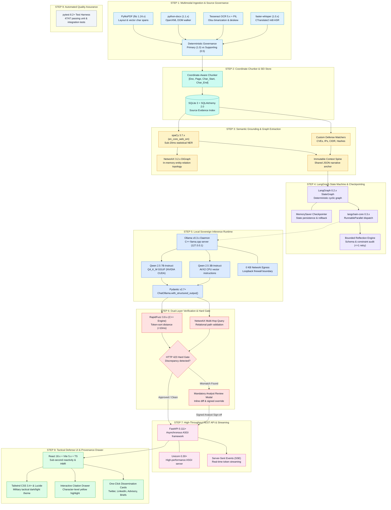

# Complex System Architecture & End-to-End Technical Dependencies
### Problem Statement ID: 26154 | National Technical Research Organisation (NTRO)
**Platform Name**: Sentinel-Transform (Sovereign Multi-Format Intelligence Transformation Platform)

---

## 1. Executive System Strategy: The Sovereign Neuro-Symbolic Pipeline

To fulfill the mission constraints of NTRO Problem Statement 26154 without relying on third-party cloud APIs or generic ungrounded RAG, **Sentinel-Transform** implements a **deterministic neuro-symbolic pipeline**. 

The system treats LLMs strictly as probabilistic drafting engines and surrounds them with:
- **Low-level coordinate parsers** mapping text to exact physical character offsets.
- **Symbolic C++ string-distance algorithms** and **in-memory knowledge graphs** that verify claims before release.
- **Deterministic state machine orchestration** with state checkpointing and physical export locks.

All external presentation generation libraries (`python-pptx`, `python-docx`) are eliminated in favor of **type-safe Pydantic v2 JSON deliverable models**, **forensic split-drawer coordinate provenance overlays**, and **resumable state checkpointing**.

```
+---------------------------------------------------------------------------------------------------------+
|                                    NINE-STEP OPERATIONAL PIPELINE                                       |
|                                                                                                         |
|  [Step 1: Multimodal Ingest] ➔ [Step 2: SEI Coordinate Store] ➔ [Step 3: Grounding & NER Extraction]    |
|                                ➔ [Step 4: LangGraph Orchestration] ➔ [Step 5: Sovereign Ollama/Qwen]     |
|                                ➔ [Step 6: RapidFuzz & GraphRAG Gate] ➔ [Step 7: FastAPI & SSE Stream]  |
|                                ➔ [Step 8: React Defense UI & Provenance] ➔ [Step 9: PyTest Suite]       |
+---------------------------------------------------------------------------------------------------------+
```

---

## 2. Step-by-Step Complex Technology Stack & Dependency Architecture



---

## 3. Deep-Dive Specification by Pipeline Step

### STEP 1: Multimodal Ingestion & Source Governance
- **PyMuPDF (`fitz` 1.24.x)**: C-accelerated document parser that walks PDF page trees, extracting character-by-character bounding box geometry `(x0, y0, x1, y1)`, font flags, and layout coordinates.
- **python-docx (1.1.x)**: Direct OpenXML DOM tree walker extracting paragraph blocks, formatting runs, and nested tables from `.docx` intelligence feeds.
- **Tesseract OCR (5.x) + Pillow (PIL)**: Local OCR pipeline for scanned imagery. Preprocessed using Otsu adaptive binarization, grayscale normalization, and morphological deskewing.
- **faster-whisper (1.0.x) (`CTranslate2`)**: C++ Transformer inference implementation for speech-to-text. Runs the quantized `small` int8 model on CPU/GPU with built-in voice activity detection (VAD), silence suppression, and sub-second timestamp alignment.
- **Deterministic Source Governance**: Mathematically bounds multi-source intake. Analysts designate exactly 1 file as **Primary ($w=1.0$)** and secondary context as **Supporting ($w=0.5$)**. Conflicting numbers are isolated and attributed to the primary authority.

### STEP 2: Forensic Coordinate Chunker & Evidence Index (SEI) Store
- **Coordinate-Aware Chunker**: Chunks text on sentence boundaries while preserving physical character slices `[char_start, char_end]` and page numbers.
- **SQLite 3 + SQLAlchemy 2.0**: Relational ACID store recording the immutable Source Evidence Index (SEI).
  - *Schema*: `chunk_id`, `doc_id`, `page_number`, `char_start`, `char_end`, `text_content`, `extracted_entities`, `authority_weight`, `sha256_hash`.

### STEP 3: Semantic Grounding & Source Entity Extraction Layer
- **spaCy 3.7.x (`en_core_web_sm`)**: Statistical Named Entity Recognition running on CPU in **<20 milliseconds**, identifying `PERSON`, `ORG`, `GPE`, and `DATE`.
- **Custom Defense Entity Matchers**: Regex tokenizers capturing defense-specific indicators: `CVE-\d{4}-\d{4,7}`, IPv4/IPv6 CIDR ranges, SHA-256 hashes, and MITRE ATT&CK technique tags (`T1059.001`).
- **NetworkX 3.2.x Directed Graph (`DiGraph`)**: Builds an in-memory topological knowledge graph from co-occurring entities in source chunks, enabling multi-hop path queries.
- **Immutable Context Spine**: Compiles a single JSON context object (narrative thesis, timeline, claim matrix) that anchors all format generators, eliminating cross-deliverable contradictions.

### STEP 4: Deterministic State Machine Orchestration & Lifecycle Control
- **LangGraph 0.2.x (`StateGraph`)**: Replaces autonomous, unpredictable agent loops with an auditable, deterministic state machine with explicit edge routing and cycle boundaries.
- **LangGraph MemorySaver**: Thread-level state checkpointer persisting state transitions to memory or SQLite, enabling review rollbacks and interrupts (`interrupt_before`).
- **langchain-core 0.3.x**: Manages prompt templating, `RunnableParallel` concurrent execution across deliverable tasks, and structured JSON output streaming.
- **Bounded Self-Reflection Engine**: Cyclic audit node evaluating:
  1. *Structural Completeness*: Are all mandatory Pydantic schema fields populated?
  2. *Length Governance*: Does Twitter content respect $\le 280$ characters? Are word counts within $\pm 15\%$ of requested detail?
  3. *Safety Cap*: Hard-bounded at **$\le 1$ retry**, mathematically guaranteeing zero infinite latency loops.

### STEP 5: Local Sovereign Reasoning Runtime & Hardware Execution
- **Ollama Daemon (v0.3.x)**: Native Windows C++ service hosting quantized GGUF weights via OpenAI-compatible endpoints (`http://127.0.0.1:11434/v1`).
- **Qwen 2.5 7B-Instruct (`Q4_K_M`, ~4.8 GB VRAM)**: Flagship reasoning model for NVIDIA CUDA on RTX 3050 GPU; generates ~35–45 tokens/second.
- **Qwen 2.5 3B-Instruct (`Q4_K_M`, ~2.8 GB RAM)**: High-speed CPU fallback using AVX2 vector instructions (~18–25 tokens/second) for standard enterprise laptops.
- **Pydantic v2.7+ Validation**: Enforces strict JSON models at inference time via `ChatOllama.with_structured_output()`, completely eliminating Markdown syntax drift.
- **Air-Gapped Telemetry Boundary**: Sockets strictly bound to loopback `127.0.0.1`; firewall verified for **0 KB outbound network traffic**.

### STEP 6: Dual-Layer Verification & Anti-Hallucination Hard Gate
- **RapidFuzz 3.9.x (C++ Engine)**: High-speed string similarity algorithm running in **<10 milliseconds** on CPU using `token_sort_ratio`.
- **Transposition & Ungrounded Detection Matrix**:
  - $100\%$ exact match ➔ Validated clean.
  - $75\% \le \text{similarity} < 100\%$ ➔ Flagged as **Entity Transposition** (e.g. *"Directorate of Grid Power Resilience"* vs *"Directorate of Power Grid Resilience"*).
  - $< 75\%$ similarity ➔ Flagged as **Ungrounded New Entity**.
- **NetworkX Relational Traversal**: Executes 2-hop graph queries to ensure relations between actors and malware strains exist in the source document.
- **HTTP 423 Hard Gate Protocol**: Automatically locks automated dissemination endpoints upon mismatch; forces the display of a human-in-the-loop review modal with yellow highlighted source excerpts.

### STEP 7: High-Throughput REST API & Streaming Layer
- **FastAPI 0.111+ & Uvicorn 0.30+**: High-throughput ASGI server utilizing `async def` non-blocking endpoints, Pydantic request validation, and OpenAPI 3.1 documentation.
- **Server-Sent Events (SSE)**: Streams incremental token generation and node transition state updates to the dashboard in real-time.

### STEP 8: Tactical Defense Frontend & Interactive Provenance Viewport
- **React 18.x + Vite 5.x + TypeScript 5.x**: Low-latency single-page application with Hot Module Replacement (HMR) and end-to-end type safety.
- **Tailwind CSS 3.4+ + Lucide React**: Tactical military dark/light defense UI theme with crisp vector operational iconography.
- **Interactive Split Citation Drawer**: Split-pane PDF viewport with character-level coordinate canvas overlays highlighting exact source text chunks in neon yellow upon hover/click.
- **One-Click Dissemination Cards**: Clean publication cards for Twitter/X threads, LinkedIn posts, executive briefs, video storyboards, and security advisories.

### STEP 9: Automated Quality Assurance
- **pytest 8.2+**: Comprehensive test suite (47/47 passing tests) covering layout parsing, coordinate slicing, LangGraph state transitions, RapidFuzz transposition detection, and HTTP 423 Hard Gate locking.

---

## 4. Complete Dependency Manifest (From First Step to Last Step)

| Dependency | Category | Exact Version | Pipeline Role & Subsystem |
|---|---|---|---|
| `pymupdf` (`fitz`) | Ingestion | `1.24.x` | PDF page tree parsing & character coordinate extraction |
| `python-docx` | Ingestion | `1.1.x` | DOCX OpenXML DOM structure & table extractor |
| `tesseract` / `pytesseract` | Ingestion | `5.x` | Local OCR engine with Otsu contrast enhancement |
| `pillow` (`PIL`) | Ingestion | `10.x` | Image deskewing, binarization & preprocessing |
| `faster-whisper` | Ingestion | `1.0.x` | CTranslate2 int8 speech-to-text with word timestamps |
| `sqlite3` | Evidence Store | Standard Lib | Relational storage for Source Evidence Index (SEI) |
| `sqlalchemy` | Evidence Store | `2.0.x` | ORM & query builder for chunk coordinates and audit logs |
| `spacy` | Grounding | `3.7.x` | Statistical NER (`en_core_web_sm`) on CPU in <20ms |
| `rapidfuzz` | Verification | `3.9.x` | C++ token-sort string distance algorithm in <10ms |
| `networkx` | Verification | `3.2.x` | In-memory directed graph for multi-hop relational GraphRAG |
| `langgraph` | Orchestration | `0.2.x` | Deterministic StateGraph cyclic state machine |
| `langchain-core` | Orchestration | `0.3.x` | Runnable interfaces & structured output bindings |
| `langchain-ollama` | Local Inference | `0.2.x` | Integration adapter connecting LangGraph to Ollama |
| `ollama` | Local Runtime | `0.3.x` | Windows C++ daemon hosting quantized GGUF weights |
| `pydantic` | Schemas & Output | `2.7.x` | Type-safe JSON schema enforcement & validation |
| `fastapi` | REST API | `0.111.x` | Asynchronous backend endpoints & HTTP 423 gate locks |
| `uvicorn` | ASGI Server | `0.30.x` | High-performance ASGI event loop (`uvloop`) |
| `python-dotenv` | Config | `1.0.x` | Environment variable management & air-gap flags |
| `pytest` | Testing | `8.2.x` | Automated test runner (47/47 passing unit/integration tests) |
| `react` | Frontend | `18.x` | Component-based tactical operator interface |
| `vite` | Frontend Build | `5.x` | High-speed frontend bundling with instant HMR |
| `typescript` | Type Safety | `5.x` | End-to-end type contracts matching Pydantic models |
| `tailwindcss` | Styling | `3.4.x` | High-contrast military defense UI aesthetic |
| `lucide-react` | Iconography | `0.350+` | Vector operational icons |
