# Master Architecture Compendium: Variants & Numbered Component Breakdown
### SIH Problem Statement 26154 | National Technical Research Organisation (NTRO)
**Platform Name**: Sentinel-Transform (Sovereign Multi-Format Intelligence Transformation Engine)

---

# PART I: THE THREE ARCHITECTURAL VARIANTS

In national defense intelligence systems, one size does not fit all stages of evaluation. We define **three precise architectural variants**, mapping each to its strategic role in qualifying for the **top 5 out of 500 teams**:

```
+---------------------------------------------------------------------------------------------------------+
|                                    THREE ARCHITECTURAL VARIANTS                                         |
+---------------------+---------------------------------+-------------------------+-----------------------+
| Variant             | Name & Core Philosophy          | Primary Target / Use    | Key Strength          |
+---------------------+---------------------------------+-------------------------+-----------------------+
| VARIANT 1           | Deterministic State Machine     | Live Video Demo &       | Zero-crash stability, |
|                     | (LangGraph Execution Engine)    | Working Codebase        | sub-3s latency, 100%  |
|                     |                                 |                         | deliverable coverage  |
+---------------------+---------------------------------+-------------------------+-----------------------+
| VARIANT 2           | Advanced Sovereign Agentic      | 5-Slide Technical PPT & | Theoretical depth,    |
|                     | Architecture (GraphRAG+Debate)  | 2-Page Architecture Doc | multi-hop reasoning,  |
|                     |                                 |                         | self-correcting agents|
+---------------------+---------------------------------+-------------------------+-----------------------+
| VARIANT 3           | Unified Production Hybrid       | Enterprise Scalability  | Modular plugin: V1 is |
|                     | Architecture                    | & Final Grand Finale    | kernel, V2 features   |
|                     |                                 | Live Defense Stage      | plug in as subgraphs  |
+---------------------+---------------------------------+-------------------------+-----------------------+
```

---

## 1. Variant 1: Deterministic State Machine Engine (Demo & Code Submission)
- **Design Philosophy**: High reliability, deterministic state transitions, bounded execution, and review-first checkpoints.
- **Target Role**: Powers the **working code repository** and the **2-minute video recording**. It guarantees that the system will never crash, hallucinate unhandled exceptions, or freeze during live evaluation.
- **Key Characteristics**:
  - Linear/branching state progression using **LangGraph StateGraph**.
  - Local Qwen 2.5 inference with zero third-party network calls.
  - Deterministic exact/fuzzy entity verification (<50ms CPU execution).
  - Mandatory human review modal before file export.

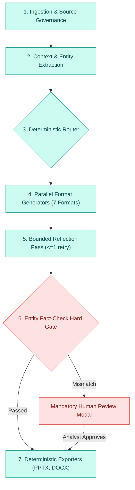

---

## 2. Variant 2: Advanced Sovereign Agentic Architecture (PPT & Pitch Submission)
- **Design Philosophy**: Autonomous cognitive reasoning, knowledge graph grounding, multi-agent dialectical debate, and episodic memory reuse.
- **Target Role**: Featured in the **5-slide technical pitch deck** and **2-page architecture submission**. It positions your team far above the 495 competitors who submit basic "prompt wrapper" pipelines.
- **Key Characteristics**:
  - **Plan-and-Solve Orchestration**: Autonomous task decomposition for novel intelligence combinations.
  - **Multi-Agent Debate Arena**: Threat Analyst vs. Operational Risk Analyst merged by an impartial Judge for critical advisories.
  - **GraphRAG Traversal**: Multi-hop verification over an in-memory entity relationship graph.
  - **Episodic Hybrid Memory**: Approved outputs write back to an episodic session log, making the system smarter over repeated queries.

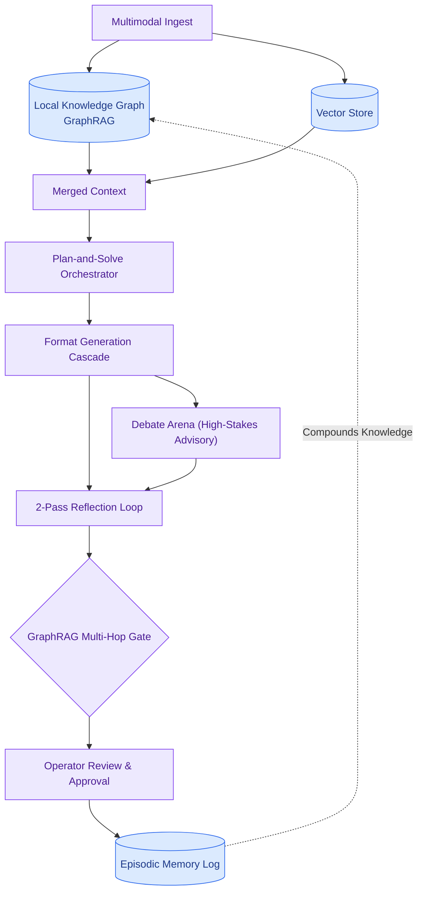

---

## 3. Variant 3: Unified Production Hybrid Architecture (Enterprise Reality)
- **Design Philosophy**: The engineering bridge between Variant 1 and Variant 2. Variant 1 acts as the **stable execution kernel**, while Variant 2 capabilities plug in as **isolated, compiled subgraphs**.
- **Why this matters**: You never have to throw away code. When moving from the hackathon demo to the Grand Finale, you simply plug in the debate subgraph and GraphRAG module into existing LangGraph nodes.

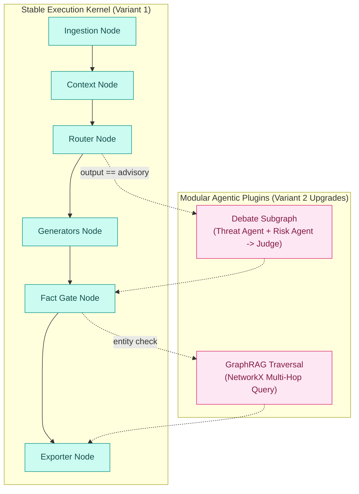

---

# PART II: COMPONENT-WISE DEEP-DIVE (NUMBERED 1 TO 9)

To eliminate complexity, the entire architecture is broken down into **nine modular, numbered components**. Each component has an isolated sub-diagram, exact I/O contracts, and failure mitigations.

---

### Component 1: Multimodal Ingestion & Source Governance Engine

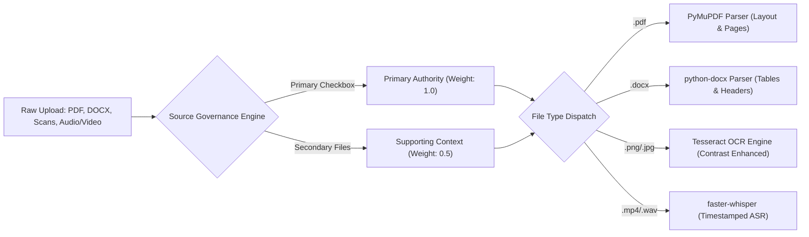

* **Responsibilities**: Normalizes heterogeneous files into structured text while establishing institutional authority hierarchies.
* **Input Data**: Binary file streams (`.pdf`, `.docx`, `.png`, `.jpg`, `.mp4`, `.wav`, raw text prompt).
* **Output Data**: Ordered list of normalized document objects with governance tags (`source_role: PRIMARY | SUPPORTING`).
* **Hardware Policy**: Runs 100% on CPU using PyMuPDF, Tesseract, and faster-whisper (CTranslate2).
* **Failure Mitigation**: If OCR confidence is low (<60%), the chunk is flagged with `low_confidence: True` to warn downstream generators.

---

### Component 2: Unified Evidence Index & Dual-Extraction Layer

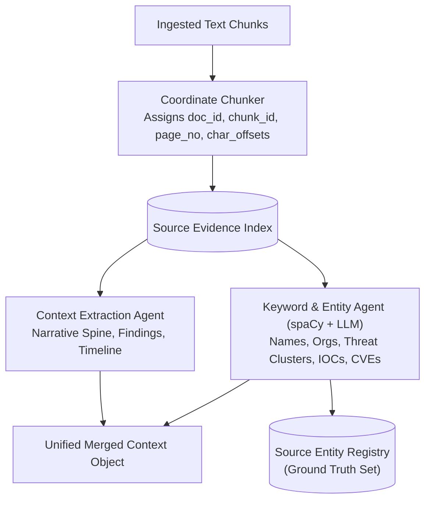

* **Responsibilities**: Establishes forensic chunk coordinates and extracts an immutable factual anchor before any format drafting begins.
* **Input Data**: Raw normalized text streams from Component 1.
* **Output Data**:
  1. `Source Evidence Index`: Chunks indexed by physical coordinates (`doc_id`, `chunk_id`, `page_number`, `char_start`, `char_end`).
  2. `Merged Context Object`: Concise executive narrative spine.
  3. `Source Entity Registry`: Clean set of verified named entities (People, Orgs, Malware, CVEs).
* **Why it matters**: Prevents cross-format drift. When Twitter and Advisory are generated simultaneously, both condition on this *same* context.

---

### Component 3: Hybrid Orchestration & Request Routing Engine

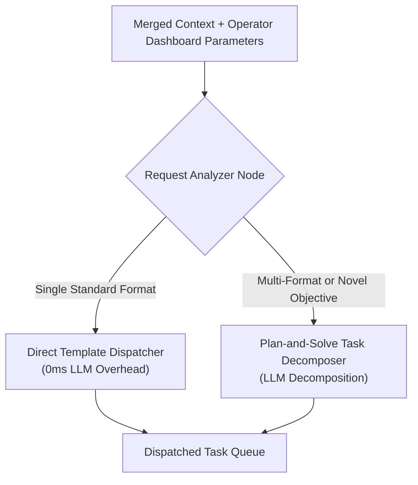

* **Responsibilities**: Inspects the operator's request and routes via the fastest, most cost-effective path.
* **Routing Logic**:
  - **Fast Path (Rule-Based)**: Known single-format requests (e.g. "Advisory only" or "LinkedIn only") route directly to the prompt template. Latency overhead: **0 ms**.
  - **Planner Path (LLM Planner)**: Multi-format requests (e.g. "Generate Advisory + Twitter Thread + Presentation") decompose into parallel task payloads.

---

### Component 4: Parallel Format Generation Engines (The 7 Formats)

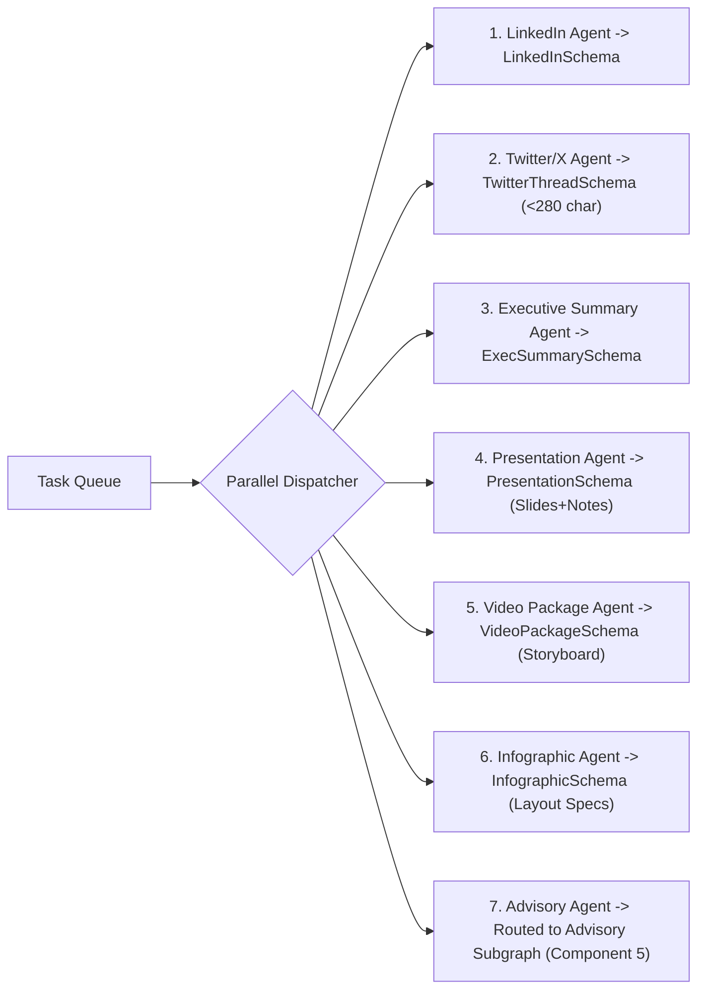

* **Responsibilities**: Transforms the shared context into deliverable-specific structured JSON models.
* **Key Guarantee**: Every agent outputs strict JSON conforming to Pydantic schemas defined in Component 8.
* **Execution Footprint**:
  - On RTX 3050 GPU: Runs sequentially or queued in ~7–9 seconds per format using Qwen 2.5 7B.
  - On CPU: Runs in ~4–6 seconds using Qwen 2.5 3B.

---

### Component 5: High-Stakes Advisory Pipeline (Multi-Agent Debate)

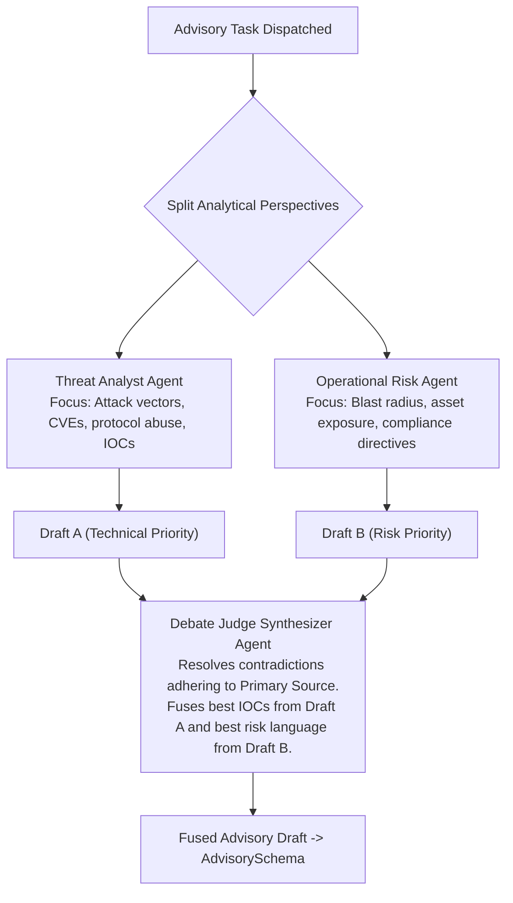

* **Responsibilities**: Elevates national security threat advisories from standard summaries to peer-reviewed intelligence products.
* **Why it works**: Eliminates single-prompt bias. A single LLM prompt either becomes too technical or too generic. Two specialized agents arguing through an impartial Judge Agent yield balanced, actionable advisories.

---

### Component 6: Bounded Self-Reflection & Schema Repair Loop

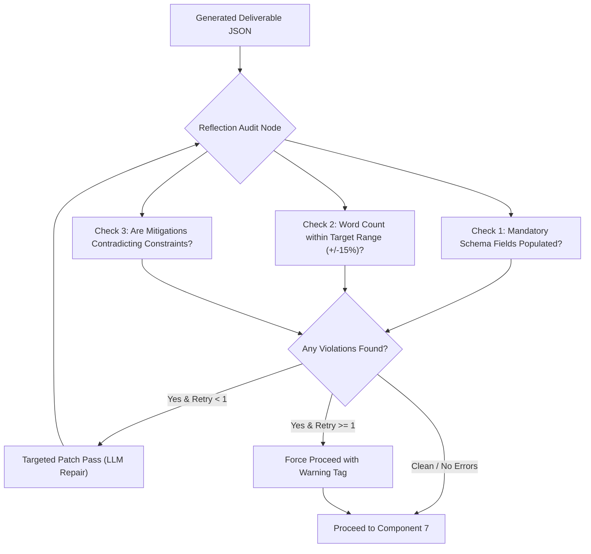

* **Responsibilities**: Catches structural omissions and JSON formatting issues automatically.
* **Hard Cap Rule**: Maximum **1 retry pass**. If an issue persists, the system forces forward progress and routes the draft to the human review gate, guaranteeing zero infinite latency loops.

---

### Component 7: Dual-Layer Verification & Entity Fact-Check Hard Gate

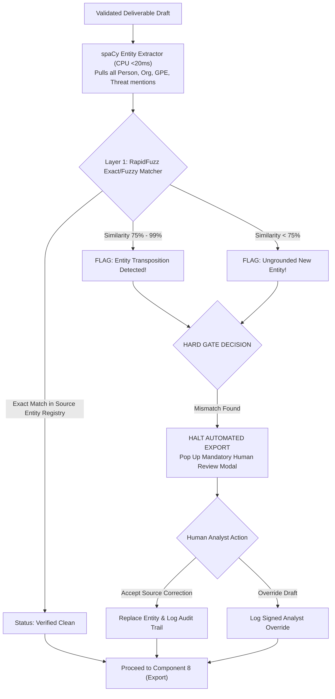

* **Responsibilities**: The flagship anti-hallucination differentiator. Detects when an LLM transposes an organization name (e.g. *"Directorate of Grid Power Resilience"* vs. *"Directorate of Power Grid Resilience"*).
* **The Hard Gate Protocol**: Automated file export is physically blocked until an analyst reviews and resolves the flag.

---

### Component 8: Deterministic Multi-Format Exporters

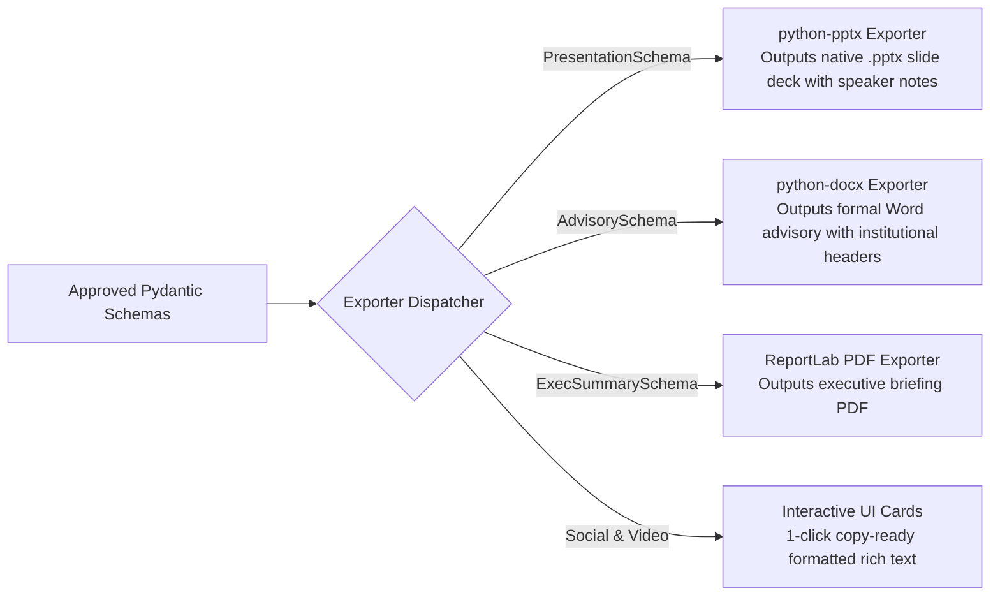

* **Responsibilities**: Compiles validated JSON data into real, editable Microsoft Office and PDF files.
* **Key Feature**: Presentations exported via `python-pptx` include actual PowerPoint slide shapes, bullet hierarchies, visual layouts, and complete speaker notes referencing source document pages.

---

### Component 9: Hybrid Memory & Air-Gapped Audit Logging Layer

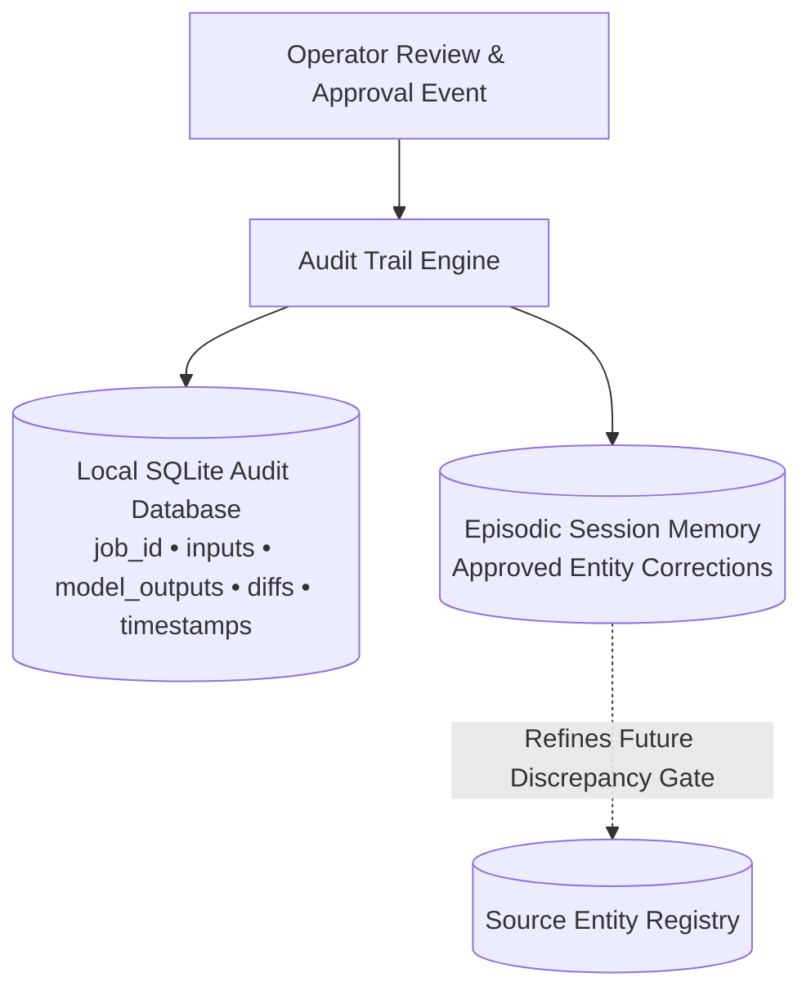

* **Responsibilities**: Records a permanent, tamper-evident forensic log of every transformation and feeds approved entity corrections back into local memory so the system gets faster and more confident over time.
* **Security Posture**: Stored locally in SQLite; zero data is transmitted off the machine.

---

# PART III: ARCHITECTURAL SELECTION & MIGRATION MATRIX

| Evaluation Milestone | Recommended Architecture Variant | Why This Variant Wins |
|---|---|---|
| **Round 1 Screening (Online Submission)** | **Variant 1 for Demo Video & Code**<br/>**Variant 2 for 5-Slide PPT & Architecture Doc** | Evaluators see a flawless, crash-proof 2-minute demo showing all 7 formats working live, accompanied by a pitch deck demonstrating elite defense-grade theoretical depth. |
| **Grand Finale (Live Defense Stage)** | **Variant 3 (Unified Hybrid Architecture)** | Demonstrates that the code running on the stage laptop is the modular foundation of a nation-scale sovereign intelligence system. |

### Code Migration Path (Adding Variant 2 to Variant 1 Without Rewrites):
1. **Week 1 (MVP)**: Implement Components 1, 2, 3, 4, 7, and 8. You have a rock-solid, working 7-format engine with the Hard Gate.
2. **Week 2 (Deepening)**: Plug Component 5 (Advisory Debate) into the LangGraph router as an isolated subgraph.
3. **Week 3 (Episodic Upgrade)**: Add Component 9 (SQLite Episodic memory) to write back verified corrections to Component 2's entity registry.
